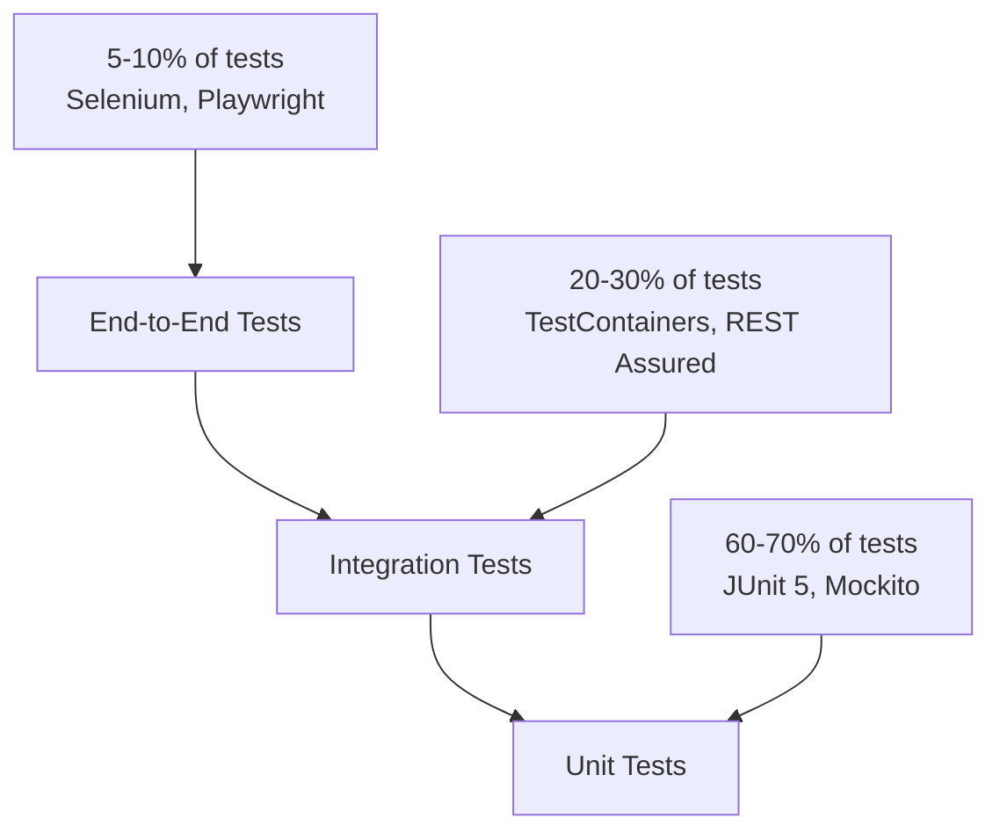
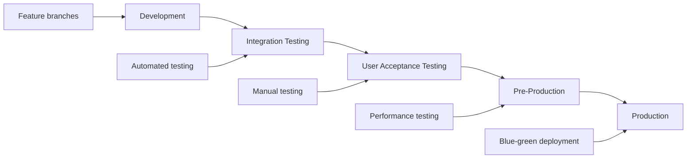

# Enterprise Application: Comprehensive Pre-Development Roadmap

> **A complete step-by-step guide covering everything that should be completed BEFORE any production code is written.** Specifically tailored for a solo developer demonstrating middle/senior-level Java engineering rigor on an enterprise application for portfolio and career advancement.

**Estimated Total Duration: 6-8 weeks (solo developer)**

---

## 0. Table of Contents
1. [Project Initiation & Vision](#1-project-initiation--vision) *(Week 1)*
2. [Stakeholder Analysis & Alignment](#2-stakeholder-analysis--alignment) *(Week 1)*
3. [Market Research & Competitive Analysis](#3-market-research--competitive-analysis) *(Week 1-2)*
4. [Business Requirements Documentation](#4-business-requirements-documentation) *(Week 2)*
5. [Risk Assessment & Feasibility Analysis](#5-risk-assessment--feasibility-analysis) *(Week 2)*
6. [Compliance & Regulatory Framework](#6-compliance--regulatory-framework) *(Week 2-3)*
7. [Technical Strategy & Architecture Planning](#7-technical-strategy--architecture-planning) *(Week 3)*
8. [System Design & Modeling](#8-system-design--modeling) *(Week 3-4)*
9. [Data Architecture & Database Design](#9-data-architecture--database-design) *(Week 4)*
10. [Security Architecture & Privacy Design](#10-security-architecture--privacy-design) *(Week 4-5)*
11. [Project Management & Agile Framework](#11-project-management--agile-framework) *(Week 5)*
12. [Development Environment & Toolchain](#12-development-environment--toolchain) *(Week 5)*
13. [Quality Assurance Strategy](#13-quality-assurance-strategy) *(Week 5-6)*
14. [CI/CD Pipeline Design](#14-cicd-pipeline-design) *(Week 6)*
15. [Monitoring & Observability Strategy](#15-monitoring--observability-strategy) *(Week 6)*
16. [Release & Deployment Strategy](#16-release--deployment-strategy) *(Week 6-7)*
17. [Documentation & Knowledge Management](#17-documentation--knowledge-management) *(Week 7)*
18. [Portfolio Preparation & Presentation](#18-portfolio-preparation--presentation) *(Week 7-8)*
19. [Final Review & Sign-off](#19-final-review--sign-off) *(Week 8)*
20. [Go-Live Readiness Checklist](#20-go-live-readiness-checklist) *(Week 8)*

---

## 1. Project Initiation & Vision *(Week 1: Days 1-2)*

### 1.1 Vision & Mission Definition
| **Deliverable** | **Template/Format** | **Purpose** | **Review Criteria** |
|-----------------|---------------------|-------------|-------------------|
| Product Vision Statement | `docs/VISION.md` | Define the "why" and strategic objectives | Clear, compelling, measurable |
| Mission Statement | Section in `VISION.md` | Articulate purpose and value | Aligned with business goals |
| Success Metrics (OKRs) | `docs/SUCCESS_METRICS.md` | Define measurable outcomes | SMART criteria compliance |
| Elevator Pitch | `docs/ELEVATOR_PITCH.md` | 30-second value proposition | Clear value articulation |

### 1.2 Project Charter
```markdown
# PROJECT_CHARTER.md Template
## Project Title
## Executive Summary
## Business Case & Justification
## Scope & Boundaries
## High-Level Requirements
## Assumptions & Constraints
## Success Criteria
## Stakeholder Register
## Initial Risk Assessment
## Budget & Resource Allocation
## Timeline & Milestones
```

### 1.3 Business Case Development
- **ROI Analysis**: NPV, IRR calculations with 3-year projection
- **Cost-Benefit Matrix**: Development vs. operational costs
- **Strategic Alignment**: How project supports organizational goals
- **Market Opportunity**: TAM/SAM/SOM analysis

---

## 2. Stakeholder Analysis & Alignment *(Week 1: Days 3-5)*

### 2.1 Stakeholder Identification & Analysis
| **Stakeholder Type** | **Examples** | **Analysis Required** | **Engagement Strategy** |
|---------------------|--------------|----------------------|------------------------|
| **Primary Users** | End users, administrators | User personas, journey mapping | User interviews, surveys |
| **Business Sponsors** | Product owners, executives | Influence/power matrix | Executive briefings |
| **Technical Teams** | DevOps, Security, QA | Technical requirements | Architecture reviews |
| **Compliance** | Legal, Risk, Audit | Regulatory requirements | Compliance workshops |
| **External** | Vendors, Partners, Customers | Integration needs | Partnership agreements |

### 2.2 Stakeholder Engagement Plan
```markdown
# STAKEHOLDER_ENGAGEMENT_PLAN.md
## Stakeholder Registry
- Name, Role, Organization
- Contact Information
- Influence Level (High/Medium/Low)
- Interest Level (High/Medium/Low)
- Engagement Frequency
- Preferred Communication Method

## RACI Matrix
- Responsible, Accountable, Consulted, Informed
- Decision-making authority
- Escalation paths
```

### 2.3 Requirements Gathering Sessions
- **Discovery Workshops**: 4-hour structured sessions
- **User Story Mapping**: Collaborative story prioritization
- **Technical Architecture Sessions**: Infrastructure and integration needs
- **Compliance & Security Reviews**: Regulatory requirement analysis

---

## 3. Market Research & Competitive Analysis *(Week 1-2)*

### 3.1 Market Analysis Framework
| **Analysis Type** | **Methodology** | **Deliverable** | **Portfolio Value** |
|-------------------|-----------------|-----------------|-------------------|
| **Competitive Landscape** | Feature comparison matrix | `docs/COMPETITIVE_ANALYSIS.md` | Market awareness |
| **Technology Trends** | Industry research | `docs/TECH_TRENDS.md` | Technical currency |
| **User Research** | Surveys, interviews | `docs/USER_RESEARCH.md` | User-centric thinking |
| **Market Sizing** | TAM/SAM/SOM analysis | `docs/MARKET_ANALYSIS.md` | Business acumen |

### 3.2 User Research & Personas
```markdown
# USER_PERSONAS.md Template
## Primary Persona: [Name]
### Demographics
### Goals & Motivations
### Pain Points & Frustrations
### Technology Proficiency
### User Journey Map
### Acceptance Criteria Preferences

## Secondary Personas...
```

---

## 4. Business Requirements Documentation *(Week 2)*

### 4.1 Business Requirements Document (BRD)
```markdown
# BUSINESS_REQUIREMENTS.md Structure
## 1. Executive Summary
## 2. Business Objectives
## 3. Scope Definition
   - In-Scope Features
   - Out-of-Scope Items
   - Future Considerations
## 4. Functional Requirements
   - Epic-level features
   - Detailed user stories
   - Acceptance criteria
## 5. Non-Functional Requirements
   - Performance benchmarks
   - Scalability requirements
   - Security standards
   - Compliance mandates
## 6. Integration Requirements
## 7. Data Requirements
## 8. Reporting & Analytics
```

### 4.2 User Story Framework (Enterprise Level)
```gherkin
# USER_STORIES.md Format
As a [user type]
I want [functionality]
So that [business value]

Acceptance Criteria:
Given [precondition]
When [action]
Then [expected result]

Definition of Done:
- [ ] Code developed and unit tested
- [ ] Integration tests pass
- [ ] Security review completed
- [ ] Performance benchmarks met
- [ ] Documentation updated
- [ ] Accessibility compliance verified
```

### 4.3 Requirements Traceability Matrix
| **Requirement ID** | **Category** | **Priority** | **Source** | **Test Cases** | **Implementation Status** |

---

## 5. Risk Assessment & Feasibility Analysis *(Week 2)*

### 5.1 Technical Feasibility Study
| **Area** | **Assessment Method** | **Deliverable** | **Risk Level** |
|----------|----------------------|-----------------|----------------|
| **Performance** | Load testing prototypes | Performance POC | High/Medium/Low |
| **Integration** | API connectivity tests | Integration matrix | High/Medium/Low |
| **Scalability** | Architecture modeling | Scalability plan | High/Medium/Low |
| **Technology Stack** | Proof of concepts | Tech evaluation | High/Medium/Low |

### 5.2 Risk Register & Mitigation Strategy
```markdown
# RISK_REGISTER.md Template
| Risk ID | Category | Description | Probability | Impact | Risk Score | Mitigation Strategy | Owner | Status |
|---------|----------|-------------|-------------|--------|------------|-------------------|-------|--------|
| R001 | Technical | Performance bottleneck | High | High | 9 | Load balancing + caching | Tech Lead | Open |
```

### 5.3 Business Case Analysis
- **Cost Analysis**: Development, infrastructure, maintenance
- **Benefit Analysis**: Quantified business value
- **ROI Calculation**: 3-year financial projection
- **Break-even Analysis**: Timeline to profitability
- **Sensitivity Analysis**: Risk scenarios

---

## 6. Compliance & Regulatory Framework *(Week 2-3)*

### 6.1 Regulatory Compliance Assessment
| **Regulation** | **Applicability** | **Requirements** | **Implementation** | **Documentation** |
|----------------|-------------------|------------------|-------------------|-------------------|
| **GDPR** | EU data subjects | Data protection, consent | Privacy by design | DPA, privacy policy |
| **CCPA** | California residents | Consumer rights | Data inventory | Privacy disclosures |
| **SOX** | Financial data | Audit trails, controls | Logging, monitoring | Compliance reports |
| **HIPAA** | Healthcare data | PHI protection | Encryption, access controls | Risk assessments |
| **PCI-DSS** | Payment processing | Card data security | Tokenization, encryption | SAQ documentation |

### 6.2 Data Governance Framework
```markdown
# DATA_GOVERNANCE.md
## Data Classification
- Public, Internal, Confidential, Restricted
- Data handling procedures
- Retention policies
- Access controls

## Privacy Impact Assessment
- Data collection justification
- Processing lawfulness
- Subject rights implementation
- Cross-border transfer mechanisms
```

---

## 7. Technical Strategy & Architecture Planning *(Week 3)*

### 7.1 Technology Stack Selection (Enterprise Java Focus)
| **Layer** | **Primary Choice** | **Alternative** | **Justification** | **ADR Reference** |
|-----------|-------------------|-----------------|-------------------|-------------------|
| **Backend Framework** | Spring Boot 3.2+ | Micronaut, Quarkus | Ecosystem maturity, enterprise adoption | ADR-001 |
| **Java Version** | OpenJDK 21 (LTS) | OpenJDK 17 | Latest LTS, performance improvements | ADR-002 |
| **Build Tool** | Maven 3.9+ | Gradle 8+ | Enterprise standardization | ADR-003 |
| **Database** | PostgreSQL 16 | Oracle, MySQL | Open source, enterprise features | ADR-004 |
| **Caching** | Redis 7+ | Hazelcast | Performance, distributed caching | ADR-005 |
| **Message Queue** | Apache Kafka | RabbitMQ, Amazon SQS | Event-driven architecture | ADR-006 |
| **Search Engine** | Elasticsearch 8+ | Apache Solr | Full-text search, analytics | ADR-007 |
| **API Gateway** | Spring Cloud Gateway | Kong, Zuul | Spring ecosystem integration | ADR-008 |
| **Security** | Spring Security 6+ | Apache Shiro | OAuth2, JWT, enterprise SSO | ADR-009 |
| **Testing** | JUnit 5, Testcontainers | TestNG, Docker Compose | Modern testing practices | ADR-010 |
| **Monitoring** | Micrometer + Prometheus | New Relic, DataDog | Open source observability | ADR-011 |
| **Documentation** | OpenAPI 3.1, AsciiDoc | Swagger 2.0 | API-first development | ADR-012 |

### 7.2 Architecture Decision Records (ADRs)
```markdown
# ADR Template: ADR-XXX-[Title].md
## Status
[Proposed | Accepted | Deprecated | Superseded]

## Context
What is the issue that we're seeing that is motivating this decision or change?

## Decision
What is the change that we're proposing and/or doing?

## Consequences
What becomes easier or more difficult to do because of this change?

## Alternatives Considered
What other options were evaluated?

## Implementation Notes
Specific technical details for implementation
```

### 7.3 Enterprise Integration Patterns
- **API Design**: RESTful services with OpenAPI specification
- **Event-Driven Architecture**: Kafka-based messaging
- **Microservices vs Modular Monolith**: Architecture decision matrix
- **Data Consistency**: Saga pattern for distributed transactions
- **Security**: OAuth2 + JWT + RBAC implementation

---

## 8. System Design & Modeling *(Week 3-4)*

### 8.1 Architecture Diagrams (C4 Model)
| **Level** | **Diagram Type** | **Tool** | **Audience** | **Deliverable** |
|-----------|------------------|----------|--------------|-----------------|
| **Level 1** | System Context | PlantUML/Mermaid | Stakeholders | `docs/diagrams/c4-context.puml` |
| **Level 2** | Container | PlantUML/Mermaid | Technical teams | `docs/diagrams/c4-container.puml` |
| **Level 3** | Component | PlantUML/Mermaid | Developers | `docs/diagrams/c4-component.puml` |
| **Level 4** | Code | IDE/PlantUML | Developers | `docs/diagrams/c4-code.puml` |

### 8.2 UML Diagrams Suite
```markdown
# Required UML Diagrams
## Behavioral Diagrams
- Use Case Diagrams (business functionality)
- Sequence Diagrams (interaction flows)
- Activity Diagrams (business processes)
- State Machine Diagrams (entity lifecycles)

## Structural Diagrams
- Class Diagrams (domain model)
- Component Diagrams (logical architecture)
- Deployment Diagrams (physical architecture)
- Package Diagrams (code organization)
```

### 8.3 Data Flow & Process Modeling
- **Data Flow Diagrams (DFD)**: System data movement
- **Business Process Models (BPMN)**: Workflow automation
- **Entity Relationship Diagrams (ERD)**: Database schema design
- **Network Architecture**: Security zones and connectivity

### 8.4 PlantUML Templates & Standards
```plantuml
# Example: docs/diagrams/templates/sequence-template.puml
@startuml
!define ENTERPRISE_THEME
!include https://raw.githubusercontent.com/plantuml-stdlib/C4-PlantUML/master/C4_Sequence.puml

title [System Name] - [Use Case] Sequence Diagram

actor "User" as user
participant "API Gateway" as gateway
participant "Authentication Service" as auth
participant "Business Service" as business
database "Database" as db

user -> gateway: Request
activate gateway
gateway -> auth: Validate Token
activate auth
auth --> gateway: Token Valid
deactivate auth
gateway -> business: Process Request
activate business
business -> db: Query Data
activate db
db --> business: Return Data
deactivate db
business --> gateway: Response
deactivate business
gateway --> user: Final Response
deactivate gateway

@enduml
```

---

## 9. Data Architecture & Database Design *(Week 4)*

### 9.1 Data Strategy & Governance
| **Component** | **Description** | **Implementation** | **Tools** |
|---------------|-----------------|-------------------|-----------|
| **Data Modeling** | Logical and physical models | Domain-driven design | PlantUML, dbdiagram.io |
| **Data Quality** | Validation, cleansing rules | Bean Validation, custom validators | Hibernate Validator |
| **Data Lineage** | Source-to-target mapping | Documentation and tooling | Apache Atlas |
| **Master Data** | Reference data management | Centralized services | Spring Boot services |

### 9.2 Database Design Standards
```sql
-- docs/database/standards/naming-conventions.sql
-- Table Naming: plural_lowercase_snake_case
-- Column Naming: snake_case
-- Primary Keys: table_name_id
-- Foreign Keys: referenced_table_name_id
-- Indexes: idx_table_column(s)
-- Constraints: ck_table_column, uk_table_column

-- Example Table Structure
CREATE TABLE user_accounts (
    user_account_id BIGSERIAL PRIMARY KEY,
    username VARCHAR(50) NOT NULL,
    email_address VARCHAR(255) NOT NULL,
    password_hash VARCHAR(255) NOT NULL,
    account_status VARCHAR(20) DEFAULT 'ACTIVE',
    created_at TIMESTAMP WITH TIME ZONE DEFAULT CURRENT_TIMESTAMP,
    updated_at TIMESTAMP WITH TIME ZONE DEFAULT CURRENT_TIMESTAMP,
    version BIGINT DEFAULT 1,
    
    CONSTRAINT uk_user_accounts_username UNIQUE (username),
    CONSTRAINT uk_user_accounts_email UNIQUE (email_address),
    CONSTRAINT ck_user_accounts_status CHECK (account_status IN ('ACTIVE', 'INACTIVE', 'SUSPENDED'))
);
```

### 9.3 Data Migration Strategy
- **Schema Versioning**: Flyway/Liquibase implementation
- **Data Archival**: Retention policies and procedures
- **Backup & Recovery**: RTO/RPO requirements
- **Performance Optimization**: Indexing and partitioning strategy

---

## 10. Security Architecture & Privacy Design *(Week 4-5)*

### 10.1 Security Framework (Zero Trust Model)
| **Security Layer** | **Technology** | **Implementation** | **Compliance** |
|-------------------|-----------------|-------------------|----------------|
| **Identity & Access** | OAuth2, JWT, RBAC | Spring Security | NIST, ISO 27001 |
| **Network Security** | TLS 1.3, VPN | nginx, WAF | PCI-DSS |
| **Data Protection** | AES-256, RSA-4096 | JCE, Vault | GDPR, HIPAA |
| **Application Security** | OWASP Top 10 | Security scanning | SANS Top 25 |
| **Infrastructure** | Container security | Kubernetes policies | CIS Benchmarks |

### 10.2 Threat Modeling (STRIDE Analysis)
```markdown
# THREAT_MODEL.md
## Assets
- User data, Authentication tokens, Business logic, Infrastructure

## Threats (STRIDE)
- **Spoofing**: Identity verification mechanisms
- **Tampering**: Data integrity controls
- **Repudiation**: Audit logging and digital signatures
- **Information Disclosure**: Access controls and encryption
- **Denial of Service**: Rate limiting and resource protection
- **Elevation of Privilege**: Principle of least privilege

## Mitigations
- Technical controls, Administrative controls, Physical controls
```

### 10.3 Privacy by Design Implementation
- **Data Minimization**: Collect only necessary data
- **Purpose Limitation**: Use data only for stated purposes
- **Consent Management**: Granular consent mechanisms
- **Right to Erasure**: Data deletion capabilities
- **Data Portability**: Export mechanisms
- **Breach Notification**: Automated detection and reporting

---

## 11. Project Management & Agile Framework *(Week 5)*

### 11.1 Agile Methodology Selection
| **Framework** | **Best For** | **Ceremonies** | **Artifacts** |
|---------------|--------------|----------------|---------------|
| **Scrum** | Structured development | Daily standups, sprints, retrospectives | Product backlog, sprint backlog, increment |
| **Kanban** | Continuous flow | WIP limits, flow metrics | Kanban board, cumulative flow diagram |
| **SAFe** | Large-scale enterprise | PI planning, system demos | Program increment, architectural runway |

### 11.2 Project Planning & Estimation
```markdown
# PROJECT_PLAN.md
## Work Breakdown Structure (WBS)
### Phase 1: Foundation (Weeks 1-4)
- Authentication & Authorization
- Core domain entities
- Basic CRUD operations
- Database setup

### Phase 2: Core Features (Weeks 5-8)
- Business logic implementation
- API development
- Integration services
- User interface

### Phase 3: Advanced Features (Weeks 9-12)
- Reporting and analytics
- Notification systems
- Performance optimization
- Security hardening

## Estimation Techniques
- Story points using Fibonacci sequence
- Planning poker sessions
- Three-point estimation (optimistic, realistic, pessimistic)
- Velocity tracking and burn-down charts
```

### 11.3 Quality Gates & Definition of Done
```yaml
# Definition of Done Checklist
code_quality:
  - [ ] Code review completed
  - [ ] Static analysis passed (SonarQube)
  - [ ] Code coverage > 80%
  - [ ] No critical security vulnerabilities

testing:
  - [ ] Unit tests written and passing
  - [ ] Integration tests passing
  - [ ] API tests passing
  - [ ] Performance tests within SLA

documentation:
  - [ ] API documentation updated
  - [ ] Technical documentation current
  - [ ] User documentation complete

compliance:
  - [ ] Security review completed
  - [ ] Accessibility compliance verified
  - [ ] Privacy impact assessed
```

---

## 12. Development Environment & Toolchain *(Week 5)*

### 12.1 Development Environment Setup
```bash
# dev-environment-setup.sh
#!/bin/bash

# Java Development Kit
sdk install java 21.0.1-oracle
sdk use java 21.0.1-oracle

# Build Tools
sdk install maven 3.9.6
sdk install gradle 8.5

# Database
docker run --name postgres-dev -e POSTGRES_PASSWORD=dev -p 5432:5432 -d postgres:16
docker run --name redis-dev -p 6379:6379 -d redis:7-alpine

# Message Queue
docker run --name kafka-dev -p 9092:9092 -d confluentinc/cp-kafka:latest

# Development Tools
# IntelliJ IDEA Ultimate / Eclipse with STS
# Docker Desktop
# Postman / Insomnia for API testing
# pgAdmin for database management
```

### 12.2 IDE Configuration & Standards
```xml
<!-- .idea/codeStyles/Project.xml for IntelliJ -->
<component name="ProjectCodeStyleConfiguration">
  <code_scheme name="Project" version="173">
    <JavaCodeStyleSettings>
      <option name="IMPORT_LAYOUT_TABLE">
        <value>
          <package name="java" withSubpackages="true" static="false"/>
          <package name="javax" withSubpackages="true" static="false"/>
          <emptyLine/>
          <package name="org" withSubpackages="true" static="false"/>
          <package name="com" withSubpackages="true" static="false"/>
          <emptyLine/>
          <package name="" withSubpackages="true" static="false"/>
          <emptyLine/>
          <package name="java" withSubpackages="true" static="true"/>
          <package name="javax" withSubpackages="true" static="true"/>
          <emptyLine/>
          <package name="" withSubpackages="true" static="true"/>
        </value>
      </option>
    </JavaCodeStyleSettings>
  </code_scheme>
</component>
```

### 12.3 Code Quality Tools Integration
| **Tool** | **Purpose** | **Configuration** | **Integration** |
|----------|-------------|-------------------|-----------------|
| **Checkstyle** | Code style enforcement | `checkstyle.xml` | Maven/Gradle plugin |
| **PMD** | Static analysis | `pmd-ruleset.xml` | IDE + CI pipeline |
| **SpotBugs** | Bug detection | `spotbugs-excludes.xml` | Build process |
| **SonarQube** | Code quality metrics | `sonar-project.properties` | CI/CD pipeline |
| **OWASP Dependency Check** | Vulnerability scanning | Maven/Gradle plugin | Security pipeline |

---

## 13. Quality Assurance Strategy *(Week 5-6)*

### 13.1 Testing Pyramid & Strategy


### 13.2 Testing Framework Configuration
```xml
<!-- pom.xml testing dependencies -->
<dependencies>
    <!-- Unit Testing -->
    <dependency>
        <groupId>org.junit.jupiter</groupId>
        <artifactId>junit-jupiter</artifactId>
        <version>5.10.1</version>
        <scope>test</scope>
    </dependency>
    
    <!-- Mocking -->
    <dependency>
        <groupId>org.mockito</groupId>
        <artifactId>mockito-core</artifactId>
        <version>5.8.0</version>
        <scope>test</scope>
    </dependency>
    
    <!-- Integration Testing -->
    <dependency>
        <groupId>org.testcontainers</groupId>
        <artifactId>postgresql</artifactId>
        <version>1.19.3</version>
        <scope>test</scope>
    </dependency>
    
    <!-- API Testing -->
    <dependency>
        <groupId>io.rest-assured</groupId>
        <artifactId>rest-assured</artifactId>
        <version>5.4.0</version>
        <scope>test</scope>
    </dependency>
    
    <!-- Performance Testing -->
    <dependency>
        <groupId>org.springframework.boot</groupId>
        <artifactId>spring-boot-starter-test</artifactId>
        <scope>test</scope>
    </dependency>
</dependencies>
```

### 13.3 Test Data Management Strategy
- **Test Data Generation**: Java Faker, Easy Random
- **Database State Management**: @Transactional, @Sql annotations
- **Environment Isolation**: TestContainers for integration tests
- **Mock Services**: WireMock for external API simulation

### 13.4 Performance Testing Framework
```java
// Example: JMeter test plan configuration
public class PerformanceTest {
    
    @Test
    public void loadTest() {
        TestPlan testPlan = TestPlan.testPlan(
            threadGroup(100, Duration.ofMinutes(5),
                httpSampler("https://api.example.com/users")
                    .method(HTTPConstants.GET)
                    .header("Authorization", "Bearer ${token}")
            ),
            influxDbListener("http://localhost:8086/write?db=jmeter")
        );
        
        TestPlanStats stats = jmeterEngine().run(testPlan);
        assertThat(stats.overall().sampleTimePercentile99()).isLessThan(Duration.ofSeconds(2));
    }
}
```

---

## 14. CI/CD Pipeline Design *(Week 6)*

### 14.1 Pipeline Architecture
```yaml
# .github/workflows/ci-cd.yml
name: Enterprise CI/CD Pipeline

on:
  push:
    branches: [ main, develop ]
  pull_request:
    branches: [ main ]

jobs:
  build:
    runs-on: ubuntu-latest
    strategy:
      matrix:
        java-version: [17, 21]
    
    steps:
    - name: Checkout code
      uses: actions/checkout@v4
      
    - name: Set up JDK
      uses: actions/setup-java@v4
      with:
        java-version: ${{ matrix.java-version }}
        distribution: 'temurin'
        
    - name: Cache Maven dependencies
      uses: actions/cache@v3
      with:
        path: ~/.m2
        key: ${{ runner.os }}-m2-${{ hashFiles('**/pom.xml') }}
        
    - name: Run tests
      run: mvn clean verify
      
    - name: SonarQube analysis
      env:
        GITHUB_TOKEN: ${{ secrets.GITHUB_TOKEN }}
        SONAR_TOKEN: ${{ secrets.SONAR_TOKEN }}
      run: mvn sonar:sonar
      
    - name: Security scan
      run: mvn org.owasp:dependency-check-maven:check
      
    - name: Build Docker image
      run: docker build -t app:${{ github.sha }} .
      
    - name: Push to registry
      if: github.ref == 'refs/heads/main'
      run: |
        echo ${{ secrets.DOCKER_PASSWORD }} | docker login -u ${{ secrets.DOCKER_USERNAME }} --password-stdin
        docker push app:${{ github.sha }}
```

### 14.2 Quality Gates Configuration
```yaml
# sonar-project.properties
sonar.projectKey=enterprise-app
sonar.organization=your-org
sonar.sources=src/main
sonar.tests=src/test
sonar.java.binaries=target/classes
sonar.java.test.binaries=target/test-classes
sonar.coverage.jacoco.xmlReportPaths=target/site/jacoco/jacoco.xml

# Quality Gate Conditions
sonar.qualitygate.wait=true
sonar.coverage.minimum=80
sonar.duplicated_lines_density.maximum=5
sonar.maintainability_rating.maximum=A
sonar.reliability_rating.maximum=A
sonar.security_rating.maximum=A
```

### 14.3 Deployment Strategies
| **Strategy** | **Use Case** | **Implementation** | **Rollback** |
|--------------|--------------|-------------------|--------------|
| **Blue-Green** | Zero-downtime production | Kubernetes deployments | Instant switch |
| **Canary** | Risk mitigation | Istio/Linkerd traffic splitting | Gradual rollback |
| **Rolling** | Resource-constrained environments | Kubernetes rolling updates | Version rollback |
| **A/B Testing** | Feature validation | Feature flags + analytics | Feature toggle |

---

## 15. Monitoring & Observability Strategy *(Week 6)*

### 15.1 Observability Stack (Spring Boot + Micrometer)
```yaml
# docker-compose.monitoring.yml
version: '3.8'
services:
  prometheus:
    image: prom/prometheus:latest
    ports:
      - "9090:9090"
    volumes:
      - ./prometheus.yml:/etc/prometheus/prometheus.yml
      
  grafana:
    image: grafana/grafana:latest
    ports:
      - "3000:3000"
    environment:
      - GF_SECURITY_ADMIN_PASSWORD=admin
    volumes:
      - grafana-storage:/var/lib/grafana
      
  jaeger:
    image: jaegertracing/all-in-one:latest
    ports:
      - "16686:16686"
      - "14268:14268"
      
  elasticsearch:
    image: docker.elastic.co/elasticsearch/elasticsearch:8.11.0
    environment:
      - discovery.type=single-node
      - xpack.security.enabled=false
    ports:
      - "9200:9200"
      
  kibana:
    image: docker.elastic.co/kibana/kibana:8.11.0
    ports:
      - "5601:5601"
    depends_on:
      - elasticsearch

volumes:
  grafana-storage:
```

### 15.2 Application Metrics Configuration
```java
// Micrometer configuration
@Configuration
public class MetricsConfiguration {
    
    @Bean
    public MeterRegistryCustomizer<MeterRegistry> metricsCommonTags() {
        return registry -> registry.config()
            .commonTags("application", "enterprise-app")
            .commonTags("environment", "${spring.profiles.active}");
    }
    
    @Bean
    public TimedAspect timedAspect(MeterRegistry registry) {
        return new TimedAspect(registry);
    }
}

// Custom metrics example
@Service
public class BusinessMetricsService {
    
    private final Counter userRegistrations;
    private final Timer dataProcessingTime;
    
    public BusinessMetricsService(MeterRegistry meterRegistry) {
        this.userRegistrations = Counter.builder("user.registrations.total")
            .description("Total user registrations")
            .register(meterRegistry);
            
        this.dataProcessingTime = Timer.builder("data.processing.time")
            .description("Data processing time")
            .register(meterRegistry);
    }
}
```

### 15.3 Structured Logging Strategy
```xml
<!-- logback-spring.xml -->
<configuration>
    <springProfile name="!local">
        <appender name="STDOUT" class="ch.qos.logback.core.ConsoleAppender">
            <encoder class="net.logstash.logback.encoder.LoggingEventCompositeJsonEncoder">
                <providers>
                    <timestamp/>
                    <logLevel/>
                    <loggerName/>
                    <message/>
                    <mdc/>
                    <arguments/>
                    <stackTrace/>
                </providers>
            </encoder>
        </appender>
    </springProfile>
    
    <root level="INFO">
        <appender-ref ref="STDOUT"/>
    </root>
</configuration>
```

### 15.4 Alerting & SLA Monitoring
```yaml
# Prometheus alerting rules
groups:
- name: application_alerts
  rules:
  - alert: HighErrorRate
    expr: rate(http_requests_total{status=~"5.."}[5m]) > 0.1
    for: 5m
    labels:
      severity: critical
    annotations:
      summary: High error rate detected
      
  - alert: HighResponseTime
    expr: histogram_quantile(0.99, rate(http_request_duration_seconds_bucket[5m])) > 2
    for: 5m
    labels:
      severity: warning
    annotations:
      summary: High response time detected
```

---

## 16. Release & Deployment Strategy *(Week 6-7)*

### 16.1 Release Management Framework
| **Release Type** | **Versioning** | **Process** | **Approval** | **Timeline** |
|------------------|----------------|-------------|--------------|--------------|
| **Major** | x.0.0 | Full regression testing | Architecture review board | Quarterly |
| **Minor** | x.y.0 | Feature testing | Product owner | Monthly |
| **Patch** | x.y.z | Hot-fix process | Technical lead | As needed |
| **Emergency** | x.y.z-hotfix | Critical bug fix | On-call manager | Immediate |

### 16.2 Infrastructure as Code (Kubernetes)
```yaml
# k8s/deployment.yml
apiVersion: apps/v1
kind: Deployment
metadata:
  name: enterprise-app
  namespace: production
spec:
  replicas: 3
  strategy:
    type: RollingUpdate
    rollingUpdate:
      maxSurge: 1
      maxUnavailable: 1
  selector:
    matchLabels:
      app: enterprise-app
  template:
    metadata:
      labels:
        app: enterprise-app
    spec:
      containers:
      - name: app
        image: enterprise-app:latest
        ports:
        - containerPort: 8080
        env:
        - name: SPRING_PROFILES_ACTIVE
          value: "production"
        - name: DATABASE_URL
          valueFrom:
            secretKeyRef:
              name: db-secret
              key: url
        resources:
          requests:
            memory: "512Mi"
            cpu: "500m"
          limits:
            memory: "1Gi"
            cpu: "1000m"
        livenessProbe:
          httpGet:
            path: /actuator/health
            port: 8080
          initialDelaySeconds: 30
          periodSeconds: 10
        readinessProbe:
          httpGet:
            path: /actuator/health/readiness
            port: 8080
          initialDelaySeconds: 5
          periodSeconds: 5
```

### 16.3 Environment Promotion Strategy


---

## 17. Documentation & Knowledge Management *(Week 7)*

### 17.1 Documentation Architecture
```
docs/
├── README.md                          # Project overview
├── CONTRIBUTING.md                    # Development guidelines
├── CHANGELOG.md                       # Version history
├── api/
│   ├── openapi.yml                   # API specification
│   └── postman-collection.json       # API testing collection
├── architecture/
│   ├── adr/                          # Architecture Decision Records
│   ├── diagrams/                     # System diagrams
│   └── design-principles.md          # Design guidelines
├── database/
│   ├── schema/                       # Database schema
│   ├── migrations/                   # Flyway scripts
│   └── data-dictionary.md            # Data definitions
├── deployment/
│   ├── kubernetes/                   # K8s manifests
│   ├── docker/                       # Container configurations
│   └── infrastructure/               # Terraform scripts
├── operations/
│   ├── runbooks/                     # Operational procedures
│   ├── monitoring/                   # Alerting configurations
│   └── troubleshooting.md            # Common issues & solutions
└── user/
    ├── user-guide.md                 # End-user documentation
    ├── admin-guide.md                # Administrative procedures
    └── training/                     # Training materials
```

### 17.2 API Documentation Standards
```yaml
# openapi.yml template
openapi: 3.1.0
info:
  title: Enterprise Application API
  version: 1.0.0
  description: |
    Comprehensive API for enterprise application management.
    
    ## Authentication
    This API uses OAuth 2.0 with JWT tokens.
    
    ## Rate Limiting
    API calls are limited to 1000 requests per hour per authenticated user.
    
  contact:
    name: API Support
    email: api-support@company.com
    url: https://docs.company.com
  license:
    name: MIT
    url: https://opensource.org/licenses/MIT

servers:
  - url: https://api.company.com/v1
    description: Production server
  - url: https://staging-api.company.com/v1
    description: Staging server

paths:
  /users:
    get:
      summary: List users
      description: Retrieve a paginated list of users with optional filtering
      parameters:
        - name: page
          in: query
          schema:
            type: integer
            default: 0
            minimum: 0
        - name: size
          in: query
          schema:
            type: integer
            default: 20
            minimum: 1
            maximum: 100
      responses:
        '200':
          description: Successful response
          content:
            application/json:
              schema:
                $ref: '#/components/schemas/UserPage'
```

### 17.3 Technical Writing Standards
- **Clarity**: Use simple, precise language
- **Structure**: Consistent formatting and organization
- **Completeness**: Cover all scenarios and edge cases
- **Currency**: Regular review and update cycles
- **Accessibility**: Multiple formats (HTML, PDF, mobile-friendly)

---

## 18. Portfolio Preparation & Presentation *(Week 7-8)*

### 18.1 Portfolio Package Structure
```
portfolio/
├── executive-summary.md               # One-page project overview
├── technical-showcase/
│   ├── architecture-portfolio.pdf    # Architecture diagrams & decisions
│   ├── code-quality-report.pdf       # SonarQube & testing metrics
│   ├── api-documentation.html        # Generated API docs
│   └── demo-videos/                  # Screen recordings
├── process-documentation/
│   ├── requirements-analysis.pdf     # BRD & user stories
│   ├── risk-management.pdf           # Risk register & mitigation
│   ├── project-management.pdf        # Agile artifacts
│   └── compliance-report.pdf         # Security & regulatory compliance
├── presentations/
│   ├── stakeholder-presentation.pptx # Executive overview
│   ├── technical-deep-dive.pptx      # Architecture presentation
│   └── demo-script.md                # Live demonstration guide
└── metrics-dashboard/
    ├── performance-benchmarks.pdf    # Load testing results
    ├── code-coverage-report.html     # Test coverage analysis
    └── ci-cd-pipeline.png           # Pipeline visualization
```

### 18.2 Key Performance Indicators (KPIs)
| **Category** | **Metric** | **Target** | **Measurement** | **Portfolio Value** |
|--------------|------------|------------|-----------------|-------------------|
| **Code Quality** | Test Coverage | >80% | JaCoCo reports | Technical rigor |
| **Performance** | Response Time | <200ms | Load testing | Scalability awareness |
| **Security** | Vulnerability Score | 0 critical | OWASP scans | Security mindset |
| **Documentation** | API Coverage | 100% | OpenAPI spec | Communication skills |
| **Process** | Requirement Traceability | 100% | RTM compliance | Methodical approach |

### 18.3 Demonstration Script
```markdown
# Live Demo Script (15-20 minutes)

## Introduction (2 minutes)
- Project overview and business value
- Technology stack and architectural decisions
- Development process highlights

## Architecture Walkthrough (5 minutes)
- C4 diagrams explanation
- Microservices vs monolith decision
- Security and compliance considerations

## Code Quality Demonstration (5 minutes)
- IDE tour with code organization
- Test suite execution
- SonarQube quality gates
- CI/CD pipeline in action

## API and Documentation (3 minutes)
- OpenAPI specification
- Postman collection demonstration
- Error handling and validation

## Monitoring and Operations (3 minutes)
- Grafana dashboards
- Log aggregation in Kibana
- Alerting configuration

## Questions and Discussion (5 minutes)
- Technical decisions rationale
- Lessons learned and improvements
- Scalability and future enhancements
```

---

## 19. Final Review & Sign-off *(Week 8)*

### 19.1 Comprehensive Review Checklist
```yaml
business_requirements:
  - [ ] All user stories have acceptance criteria
  - [ ] Non-functional requirements are quantified
  - [ ] Business stakeholder sign-off obtained
  - [ ] Requirements traceability matrix complete

technical_architecture:
  - [ ] All ADRs documented and approved
  - [ ] Security review completed
  - [ ] Performance benchmarks established
  - [ ] Scalability plan documented

quality_assurance:
  - [ ] Test strategy approved
  - [ ] Automation framework ready
  - [ ] Quality gates defined
  - [ ] Performance test scenarios ready

operations:
  - [ ] Monitoring strategy implemented
  - [ ] Deployment automation ready
  - [ ] Disaster recovery plan documented
  - [ ] Security incident response plan ready

compliance:
  - [ ] Data privacy impact assessment complete
  - [ ] Security controls documented
  - [ ] Audit trail mechanisms ready
  - [ ] Regulatory compliance verified

portfolio_readiness:
  - [ ] All documentation reviewed and polished
  - [ ] Diagrams exported and formatted
  - [ ] Demo environment prepared
  - [ ] Presentation materials finalized
```

### 19.2 Stakeholder Sign-off Matrix
| **Stakeholder** | **Document** | **Approval Required** | **Status** | **Date** |
|-----------------|--------------|----------------------|------------|----------|
| **Business Sponsor** | Business Requirements | Yes | ⏳ Pending | |
| **Technical Architect** | System Architecture | Yes | ⏳ Pending | |
| **Security Officer** | Security Assessment | Yes | ⏳ Pending | |
| **Compliance Manager** | Regulatory Review | Yes | ⏳ Pending | |
| **Operations Manager** | Deployment Strategy | Yes | ⏳ Pending | |

---

## 20. Go-Live Readiness Checklist *(Week 8)*

### 20.1 Production Readiness Assessment
```yaml
# Production Readiness Scorecard
infrastructure:
  score: __/100
  criteria:
    - [ ] High availability configuration (Load balancers, redundancy)
    - [ ] Auto-scaling policies configured
    - [ ] Backup and disaster recovery tested
    - [ ] Security hardening complete
    - [ ] Performance benchmarks met

application:
  score: __/100
  criteria:
    - [ ] All critical paths tested
    - [ ] Error handling comprehensive
    - [ ] Logging and monitoring integrated
    - [ ] Configuration externalized
    - [ ] Health checks implemented

operations:
  score: __/100
  criteria:
    - [ ] Deployment automation verified
    - [ ] Rollback procedures tested
    - [ ] Monitoring alerts configured
    - [ ] Incident response procedures documented
    - [ ] Staff training completed

minimum_score_required: 85
```

### 20.2 Launch Day Procedures
```markdown
# GO_LIVE_CHECKLIST.md

## Pre-Launch (T-1 week)
- [ ] Final smoke tests in production-like environment
- [ ] Stakeholder communication sent
- [ ] Support team briefed
- [ ] Monitoring dashboards verified
- [ ] Rollback plan confirmed

## Launch Day (T-0)
- [ ] System health verified
- [ ] Deployment executed
- [ ] Smoke tests passed
- [ ] Monitoring confirmed
- [ ] Stakeholders notified
- [ ] Documentation updated

## Post-Launch (T+1 week)
- [ ] Performance metrics reviewed
- [ ] User feedback collected
- [ ] Issues logged and prioritized
- [ ] Lessons learned documented
- [ ] Success metrics measured
```

---

## 📁 Recommended Directory Structure

```
enterprise-application/
├── .github/
│   ├── workflows/              # CI/CD pipeline definitions
│   ├── ISSUE_TEMPLATE/         # Issue templates
│   └── PULL_REQUEST_TEMPLATE.md
├── docs/
│   ├── adr/                    # Architecture Decision Records
│   ├── api/                    # API documentation
│   ├── architecture/           # System design documents
│   ├── business/               # Business requirements
│   ├── compliance/             # Regulatory documentation
│   ├── database/               # Database schemas and migrations
│   ├── deployment/             # Deployment guides
│   ├── diagrams/               # UML and system diagrams
│   ├── operations/             # Operational runbooks
│   ├── security/               # Security documentation
│   └── user/                   # User guides
├── src/
│   ├── main/
│   │   ├── java/               # Application source code
│   │   ├── resources/          # Configuration files
│   │   └── docker/             # Docker configurations
│   └── test/
│       ├── java/               # Test source code
│       ├── resources/          # Test configurations
│       └── integration/        # Integration test suites
├── infrastructure/
│   ├── terraform/              # Infrastructure as Code
│   ├── kubernetes/             # K8s manifests
│   └── monitoring/             # Monitoring configurations
├── tools/
│   ├── quality/                # Code quality configurations
│   ├── security/               # Security scanning tools
│   └── performance/            # Performance testing tools
├── portfolio/
│   ├── presentations/          # Portfolio presentations
│   ├── demos/                  # Demo videos and scripts
│   └── metrics/                # KPI dashboards and reports
├── .gitignore
├── README.md
├── CONTRIBUTING.md
├── CHANGELOG.md
├── LICENSE
├── pom.xml                     # Maven build configuration
└── docker-compose.yml         # Local development environment
```

---

## 🎯 Success Metrics & Portfolio KPIs

### Technical Excellence Indicators
| **Metric** | **Target** | **Measurement** | **Portfolio Evidence** |
|------------|------------|-----------------|----------------------|
| **Code Coverage** | >85% | JaCoCo + SonarQube | Coverage reports + badges |
| **Technical Debt** | <5% | SonarQube debt ratio | Quality gate screenshots |
| **API Documentation** | 100% coverage | OpenAPI completeness | Generated docs + Postman collections |
| **Security Score** | 0 critical vulnerabilities | OWASP + Snyk scans | Security scan reports |
| **Performance** | <200ms P99 response time | JMeter + Gatling | Load test reports |

### Process Maturity Indicators
| **Area** | **Evidence** | **Senior Developer Value** |
|----------|--------------|---------------------------|
| **Requirements Engineering** | Complete BRD with RTM | Business analysis skills |
| **Architecture Design** | C4 model + ADRs | System thinking |
| **Risk Management** | Risk register + mitigation plans | Risk awareness |
| **Quality Assurance** | Comprehensive test strategy | Quality mindset |
| **Security by Design** | Threat model + security controls | Security expertise |

---

## 🚀 How to Use This Roadmap

### Phase 1: Planning (Weeks 1-2)
1. **Fork/Clone** this roadmap into your project repository
2. **Customize** sections based on your specific application domain
3. **Create** detailed project schedule with milestones
4. **Set up** tracking mechanisms (Jira, GitHub Projects, etc.)

### Phase 2: Execution (Weeks 3-6)
1. **Follow** the roadmap systematically, completing each deliverable
2. **Document** all decisions and rationale in appropriate formats
3. **Version control** all artifacts for portfolio compilation
4. **Review** and iterate based on feedback and learning

### Phase 3: Portfolio Assembly (Weeks 7-8)
1. **Compile** all documentation into portfolio-ready formats
2. **Create** executive summaries and presentation materials
3. **Prepare** demonstration environment and scripts
4. **Practice** technical presentations and explanations

### Phase 4: Continuous Improvement
1. **Collect feedback** from portfolio reviews and interviews
2. **Iterate** on documentation and presentation materials
3. **Update** based on industry trends and new technologies
4. **Maintain** currency of all technical artifacts

---

## 📝 Portfolio Presentation Tips

### For Technical Interviews
- **Lead with architecture**: Show system thinking and design skills
- **Demonstrate process**: Highlight methodical approach and best practices
- **Explain decisions**: Articulate rationale behind technical choices
- **Show metrics**: Quantify quality, performance, and compliance
- **Discuss trade-offs**: Demonstrate understanding of engineering decisions

### For Management Discussions
- **Business value**: Connect technical decisions to business outcomes
- **Risk mitigation**: Highlight proactive risk management
- **Process maturity**: Show enterprise-grade development practices
- **Compliance awareness**: Demonstrate understanding of regulatory requirements
- **Team leadership**: Showcase ability to guide technical direction

---

> **Success Formula:** Thorough Planning + Methodical Execution + Comprehensive Documentation = Senior Developer Portfolio

> **Remember:** This roadmap demonstrates not just coding ability, but the complete skill set expected of a senior enterprise Java developer: business analysis, system design, risk management, quality assurance, security awareness, and technical leadership.

---

**Version:** 2.0  
**Last Updated:** July 2025  
**Author:** Stefan Kostyk
**License:** MIT