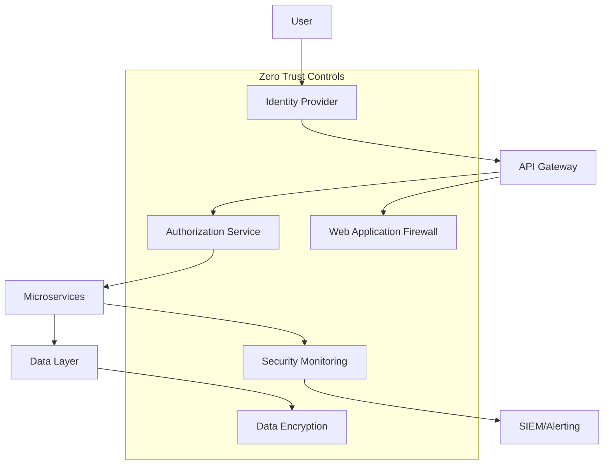
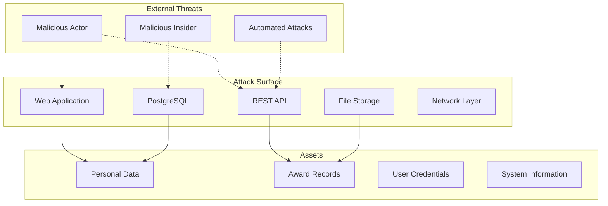

# Security Framework Implementation: Award Monitoring & Tracking System

**Project**: Award Monitoring & Tracking System for Ukrainian Universities  
**Context**: Solo Developer Portfolio Project (Free/Open Source)  
**Framework Version**: 1.0  
**Effective Date**: August 2025  
**Security Officer**: Stefan Kostyk (Solo Developer)  
**Security Model**: Zero Trust Architecture with STRIDE Threat Modeling

---

## Executive Summary

This Security Framework implements a Zero Trust architecture with comprehensive threat modeling for the Award Monitoring & Tracking System. The framework ensures robust security posture appropriate for handling sensitive academic data while maintaining public transparency requirements.

**Security Principles**:
- **Zero Trust**: Never trust, always verify - no implicit trust zones
- **Defense in Depth**: Multiple security layers and controls
- **Privacy by Design**: Security controls that protect data privacy
- **Threat-Driven**: STRIDE methodology for systematic threat identification

**Security Objectives**:
- Protect personal data of university employees
- Ensure data integrity of award records
- Maintain system availability and performance
- Prevent unauthorized access and data breaches

---

## 1. Zero Trust Architecture Implementation

### **1.1 Zero Trust Principles**

| **Principle** | **Implementation** | **Technology** | **Verification Method** |
|---------------|-------------------|----------------|-------------------------|
| **Verify Explicitly** | Multi-factor authentication, device validation | OAuth2 + JWT + MFA | Token validation, device fingerprinting |
| **Least Privilege Access** | Role-based permissions, just-in-time access | Spring Security RBAC | Permission auditing, access reviews |
| **Assume Breach** | Continuous monitoring, incident response | SIEM, anomaly detection | Real-time alerting, forensic logging |
| **Micro-Segmentation** | Service isolation, network controls | Kubernetes network policies | Traffic inspection, service mesh |
| **Data-Centric Security** | Encryption, data loss prevention | AES-256, field-level encryption | Encryption auditing, data classification |

### **1.2 Zero Trust Architecture Components**



### **1.3 Identity and Access Management (IAM)**

```java
// Zero Trust Authentication Implementation
@Configuration
public class ZeroTrustSecurityConfig {
    
    @Bean
    public SecurityFilterChain filterChain(HttpSecurity http) throws Exception {
        return http
            .sessionManagement(session -> 
                session.sessionCreationPolicy(SessionCreationPolicy.STATELESS))
            .oauth2ResourceServer(oauth2 -> oauth2
                .jwt(jwt -> jwt
                    .jwtAuthenticationConverter(jwtAuthenticationConverter())
                    .jwtDecoder(jwtDecoder())))
            .authorizeHttpRequests(authz -> authz
                .requestMatchers("/api/public/**").permitAll()
                .requestMatchers("/api/admin/**").hasRole("ADMIN")
                .anyRequest().authenticated())
            .exceptionHandling(ex -> ex
                .authenticationEntryPoint(authenticationEntryPoint())
                .accessDeniedHandler(accessDeniedHandler()))
            .build();
    }
    
    @Bean
    public JwtAuthenticationConverter jwtAuthenticationConverter() {
        JwtAuthenticationConverter converter = new JwtAuthenticationConverter();
        converter.setJwtGrantedAuthoritiesConverter(jwt -> {
            // Zero Trust: Explicit permission mapping
            List<String> roles = jwt.getClaimAsStringList("roles");
            List<String> permissions = jwt.getClaimAsStringList("permissions");
            
            return Stream.concat(
                roles.stream().map(role -> new SimpleGrantedAuthority("ROLE_" + role)),
                permissions.stream().map(SimpleGrantedAuthority::new)
            ).collect(Collectors.toList());
        });
        return converter;
    }
}

// Continuous Authentication Verification
@Component
public class ContinuousAuthenticationService {
    
    @EventListener
    public void verifyRequest(AuthenticationEvent event) {
        Authentication auth = event.getAuthentication();
        
        // Zero Trust: Verify every request
        if (!isTokenValid(auth) || 
            !isDeviceAuthorized(auth) || 
            !isRequestPatternNormal(auth)) {
            
            securityEventPublisher.publishEvent(
                new SuspiciousActivityEvent(auth, "Continuous auth failure"));
            throw new AuthenticationException("Continuous verification failed");
        }
        
        // Update last verified timestamp
        updateLastVerification(auth);
    }
    
    private boolean isRequestPatternNormal(Authentication auth) {
        UserBehaviorProfile profile = behaviorService.getProfile(auth.getName());
        RequestPattern current = RequestPattern.fromRequest();
        
        return behaviorAnalyzer.isPatternNormal(profile, current);
    }
}
```

### **1.4 Micro-Segmentation Strategy**

```yaml
# Kubernetes Network Policies - Zero Trust Networking
apiVersion: networking.k8s.io/v1
kind: NetworkPolicy
metadata:
  name: award-service-policy
  namespace: production
spec:
  podSelector:
    matchLabels:
      app: award-service
  policyTypes:
  - Ingress
  - Egress
  ingress:
  - from:
    - podSelector:
        matchLabels:
          app: api-gateway
    ports:
    - protocol: TCP
      port: 8080
  egress:
  - to:
    - podSelector:
        matchLabels:
          app: database
    ports:
    - protocol: TCP
      port: 5432
  - to:
    - podSelector:
        matchLabels:
          app: redis-cache
    ports:
    - protocol: TCP
      port: 6379

---
# Service Mesh Security (Istio)
apiVersion: security.istio.io/v1beta1
kind: PeerAuthentication
metadata:
  name: default
  namespace: production
spec:
  mtls:
    mode: STRICT

---
apiVersion: security.istio.io/v1beta1
kind: AuthorizationPolicy
metadata:
  name: award-service-authz
  namespace: production
spec:
  selector:
    matchLabels:
      app: award-service
  rules:
  - from:
    - source:
        principals: ["cluster.local/ns/production/sa/api-gateway"]
    to:
    - operation:
        methods: ["GET", "POST", "PUT"]
        paths: ["/api/awards/*"]
    when:
    - key: source.ip
      notValues: ["0.0.0.0/0"]
```

---

## 2. STRIDE Threat Modeling

### **2.1 STRIDE Methodology Overview**

| **Threat Category** | **Definition** | **Security Property** | **Mitigation Strategy** |
|-------------------|----------------|----------------------|------------------------|
| **Spoofing Identity** | Impersonating users or systems | Authentication | Multi-factor authentication, certificate validation |
| **Tampering with Data** | Unauthorized data modification | Integrity | Digital signatures, checksums, input validation |
| **Repudiation** | Denying actions performed | Non-repudiation | Audit logging, digital signatures, timestamps |
| **Information Disclosure** | Unauthorized information access | Confidentiality | Encryption, access controls, data classification |
| **Denial of Service** | Disrupting system availability | Availability | Rate limiting, resource monitoring, redundancy |
| **Elevation of Privilege** | Gaining unauthorized permissions | Authorization | Least privilege, role validation, permission auditing |

### **2.2 System Architecture Threat Model**



### **2.3 STRIDE Threat Analysis Matrix**

| **Component** | **Spoofing** | **Tampering** | **Repudiation** | **Info Disclosure** | **DoS** | **Elevation** |
|---------------|--------------|---------------|-----------------|-------------------|---------|---------------|
| **Web Frontend** | ❌ Session hijacking | ❌ XSS attacks | ✅ User tracking | ❌ Data exposure | ❌ DDoS | ❌ CSRF |
| **API Gateway** | ❌ Token spoofing | ❌ Request manipulation | ✅ Request logging | ❌ API enumeration | ❌ Rate limiting bypass | ❌ Auth bypass |
| **Auth Service** | ❌ Credential theft | ❌ Token tampering | ✅ Auth logging | ❌ Credential exposure | ❌ Auth flooding | ❌ Privilege escalation |
| **Database** | ❌ SQL injection | ❌ Data corruption | ✅ Transaction logs | ❌ Data dumps | ❌ Connection exhaustion | ❌ Permission bypass |
| **File Storage** | ❌ Path traversal | ❌ File corruption | ✅ Access logging | ❌ Unauthorized access | ❌ Storage exhaustion | ❌ Permission escalation |

**Legend**: ❌ = Threat Present, ✅ = Mitigated

### **2.4 Detailed Threat Analysis**

#### **2.4.1 Spoofing Threats**

| **Threat ID** | **Threat** | **Impact** | **Likelihood** | **Risk Score** | **Mitigation** |
|---------------|------------|------------|----------------|----------------|----------------|
| **S001** | User identity spoofing via stolen credentials | High | Medium | 8 | MFA, device verification, behavioral analysis |
| **S002** | Service identity spoofing in microservices | High | Low | 6 | mTLS, service certificates, service mesh |
| **S003** | Admin account impersonation | Critical | Low | 9 | Hardware security keys, admin approval workflows |
| **S004** | API client spoofing | Medium | Medium | 6 | API key validation, client certificates |

#### **2.4.2 Tampering Threats**

| **Threat ID** | **Threat** | **Impact** | **Likelihood** | **Risk Score** | **Mitigation** |
|---------------|------------|------------|----------------|----------------|----------------|
| **T001** | Award data manipulation | High | Low | 6 | Digital signatures, audit trails, approval workflows |
| **T002** | User profile tampering | Medium | Medium | 6 | Input validation, change auditing, role permissions |
| **T003** | System configuration changes | High | Low | 6 | Configuration immutability, change approval |
| **T004** | Database record modification | Critical | Low | 9 | Database-level integrity, checksums, replication |

#### **2.4.3 Information Disclosure Threats**

| **Threat ID** | **Threat** | **Impact** | **Likelihood** | **Risk Score** | **Mitigation** |
|---------------|------------|------------|----------------|----------------|----------------|
| **I001** | Personal data exposure via API | High | Medium | 8 | Data classification, field-level encryption, access controls |
| **I002** | Award document unauthorized access | Medium | Medium | 6 | Document access controls, watermarking, audit logging |
| **I003** | System information leakage | Low | High | 5 | Error message sanitization, security headers |
| **I004** | Database backup exposure | Critical | Low | 9 | Backup encryption, secure storage, access controls |

### **2.5 Threat Mitigation Implementation**

```java
// Comprehensive Security Service
@Service
public class ThreatMitigationService {
    
    // S001: Spoofing Mitigation - Behavioral Analysis
    @EventListener
    public void analyzeUserBehavior(UserActionEvent event) {
        UserBehaviorProfile profile = behaviorService.getProfile(event.getUserId());
        ActionPattern currentPattern = ActionPattern.from(event);
        
        if (behaviorAnalyzer.isAnomalous(profile, currentPattern)) {
            securityEventPublisher.publishEvent(
                new AnomalousActivityEvent(event.getUserId(), currentPattern));
            
            // Require additional verification
            authenticationService.requireReAuthentication(event.getUserId());
        }
    }
    
    // T001: Tampering Mitigation - Data Integrity
    @EventListener
    public void validateDataIntegrity(DataModificationEvent event) {
        String expectedChecksum = checksumService.calculateChecksum(event.getOriginalData());
        String actualChecksum = event.getDataChecksum();
        
        if (!expectedChecksum.equals(actualChecksum)) {
            auditService.logSecurityEvent(
                SecurityEventType.DATA_TAMPERING_DETECTED, 
                event.getUserId(), 
                event.getResourceId());
            
            throw new DataIntegrityException("Data tampering detected");
        }
    }
    
    // I001: Information Disclosure Mitigation - Data Masking
    @PostFilter("@securityService.canViewSensitiveData(authentication, filterObject)")
    public List<UserProfile> searchUsers(String query) {
        List<UserProfile> results = userService.search(query);
        
        return results.stream()
            .map(profile -> maskSensitiveData(profile, getCurrentUser()))
            .collect(Collectors.toList());
    }
    
    private UserProfile maskSensitiveData(UserProfile profile, User viewer) {
        if (!securityService.canViewPersonalData(viewer, profile.getUserId())) {
            profile.setEmail("***@***.***");
            profile.setPhone("***-***-****");
            profile.setAddress(null);
        }
        return profile;
    }
}
```

---

## 3. Security Controls Implementation

### **3.1 Authentication & Authorization**

```java
// Multi-Factor Authentication Implementation
@Service
public class MultiFactorAuthService {
    
    public AuthenticationResult authenticate(LoginRequest request) {
        // Primary authentication
        User user = validateCredentials(request.getUsername(), request.getPassword());
        
        // Risk assessment
        RiskScore riskScore = riskAssessmentService.calculateRisk(user, request);
        
        if (riskScore.requiresMFA()) {
            // Initiate MFA challenge
            MFAChallenge challenge = mfaService.createChallenge(user);
            return AuthenticationResult.requiresMFA(challenge);
        }
        
        // Generate secure session
        JwtToken token = jwtService.generateToken(user);
        sessionService.createSession(user, token, request.getDeviceInfo());
        
        return AuthenticationResult.success(token);
    }
    
    public boolean validateMFA(String userId, String challengeId, String response) {
        MFAChallenge challenge = mfaService.getChallenge(challengeId);
        
        if (challenge.isExpired() || !challenge.getUserId().equals(userId)) {
            auditService.logSecurityEvent(
                SecurityEventType.MFA_VALIDATION_FAILED, userId, challengeId);
            return false;
        }
        
        return switch (challenge.getType()) {
            case TOTP -> totpValidator.validate(challenge.getSecret(), response);
            case SMS -> smsValidator.validate(challenge.getCode(), response);
            case EMAIL -> emailValidator.validate(challenge.getCode(), response);
            case HARDWARE_KEY -> hardwareKeyValidator.validate(challenge.getKeyId(), response);
        };
    }
}
```

### **3.2 Data Encryption Strategy**

```java
// Comprehensive Encryption Service
@Service
public class EncryptionService {
    
    private final KeyManagementService keyService;
    private final AESUtils aesUtils;
    private final RSAUtils rsaUtils;
    
    // Field-level encryption for sensitive data
    @EncryptedField(keyType = KeyType.PERSONAL_DATA)
    public String encryptPersonalData(String data, String userId) {
        String dataKey = keyService.getDataEncryptionKey(userId);
        return aesUtils.encrypt(data, dataKey);
    }
    
    // Document encryption with user-specific keys
    public EncryptedDocument encryptDocument(Document document, String userId) {
        // Generate unique document key
        String documentKey = keyService.generateDocumentKey();
        
        // Encrypt document content
        byte[] encryptedContent = aesUtils.encrypt(document.getContent(), documentKey);
        
        // Encrypt document key with user's public key
        String userPublicKey = keyService.getUserPublicKey(userId);
        String encryptedKey = rsaUtils.encrypt(documentKey, userPublicKey);
        
        return EncryptedDocument.builder()
            .encryptedContent(encryptedContent)
            .encryptedKey(encryptedKey)
            .keyId(keyService.getKeyId(userId))
            .algorithm("AES-256-GCM")
            .build();
    }
    
    // Key rotation for compliance
    @Scheduled(cron = "0 0 0 1 * ?") // Monthly key rotation
    public void rotateEncryptionKeys() {
        List<String> expiredKeys = keyService.getExpiredKeys();
        
        for (String keyId : expiredKeys) {
            String newKey = keyService.generateKey();
            reEncryptDataWithNewKey(keyId, newKey);
            keyService.archiveKey(keyId);
        }
    }
}
```

### **3.3 Security Monitoring & Incident Response**

```java
// Security Event Detection and Response
@Component
public class SecurityEventProcessor {
    
    @EventListener
    @Async
    public void processSecurityEvent(SecurityEvent event) {
        // Immediate threat assessment
        ThreatLevel threatLevel = threatAssessmentService.assess(event);
        
        // Log to SIEM
        siemService.logEvent(event, threatLevel);
        
        // Automated response based on threat level
        switch (threatLevel) {
            case CRITICAL -> handleCriticalThreat(event);
            case HIGH -> handleHighThreat(event);
            case MEDIUM -> handleMediumThreat(event);
            case LOW -> handleLowThreat(event);
        }
        
        // Update threat intelligence
        threatIntelligenceService.updateIndicators(event);
    }
    
    private void handleCriticalThreat(SecurityEvent event) {
        // Immediate containment
        if (event.getUserId() != null) {
            userService.suspendUser(event.getUserId(), "Security incident");
        }
        
        // Block source IP
        firewallService.blockIP(event.getSourceIP());
        
        // Immediate alert to security team
        alertService.sendCriticalAlert(event);
        
        // Initiate incident response
        incidentResponseService.createIncident(event, IncidentSeverity.CRITICAL);
    }
    
    private void handleHighThreat(SecurityEvent event) {
        // Additional monitoring
        monitoringService.increaseMonitoring(event.getUserId(), Duration.ofHours(24));
        
        // Require re-authentication
        if (event.getUserId() != null) {
            authenticationService.invalidateSessions(event.getUserId());
        }
        
        // Alert security team
        alertService.sendHighPriorityAlert(event);
    }
}

// Anomaly Detection Service
@Service
public class AnomalyDetectionService {
    
    private final MachineLearningModel behaviorModel;
    
    public AnomalyScore detectAnomaly(UserActivity activity) {
        // Feature extraction
        ActivityFeatures features = extractFeatures(activity);
        
        // ML-based anomaly detection
        double anomalyScore = behaviorModel.predict(features);
        
        // Statistical analysis
        double statisticalScore = statisticalAnalyzer.analyze(activity);
        
        // Rule-based detection
        double ruleBasedScore = ruleEngine.evaluate(activity);
        
        // Weighted composite score
        double finalScore = (anomalyScore * 0.5) + 
                           (statisticalScore * 0.3) + 
                           (ruleBasedScore * 0.2);
        
        return AnomalyScore.builder()
            .overallScore(finalScore)
            .mlScore(anomalyScore)
            .statisticalScore(statisticalScore)
            .ruleBasedScore(ruleBasedScore)
            .threshold(0.8)
            .isAnomalous(finalScore > 0.8)
            .build();
    }
    
    private ActivityFeatures extractFeatures(UserActivity activity) {
        return ActivityFeatures.builder()
            .timeOfDay(activity.getTimestamp().getHour())
            .dayOfWeek(activity.getTimestamp().getDayOfWeek().getValue())
            .actionType(activity.getActionType())
            .resourceType(activity.getResourceType())
            .sourceIP(activity.getSourceIP())
            .userAgent(activity.getUserAgent())
            .sessionDuration(activity.getSessionDuration())
            .requestFrequency(activity.getRequestFrequency())
            .build();
    }
}
```

### **3.4 Vulnerability Management**

```yaml
# Security Scanning Pipeline
security_scanning:
  static_analysis:
    tools:
      - sonarqube
      - checkmarx
      - spotbugs
    frequency: every_commit
    thresholds:
      critical: 0
      high: 2
      medium: 10
      
  dependency_scanning:
    tools:
      - owasp_dependency_check
      - snyk
      - npm_audit
    frequency: daily
    auto_update: minor_versions
    
  dynamic_analysis:
    tools:
      - owasp_zap
      - burp_suite
      - nikto
    frequency: weekly
    scope: full_application
    
  infrastructure_scanning:
    tools:
      - nessus
      - openvas
      - qualys
    frequency: monthly
    scope: all_assets
    
  container_scanning:
    tools:
      - clair
      - aqua_security
      - twistlock
    frequency: every_build
    base_images: approved_only
```

---

## 4. Security Metrics & KPIs

### **4.1 Security Performance Indicators**

| **Metric** | **Target** | **Measurement** | **Frequency** | **Alert Threshold** |
|------------|------------|-----------------|---------------|-------------------|
| **Mean Time to Detection (MTTD)** | < 5 minutes | Alert timestamp - incident timestamp | Real-time | > 10 minutes |
| **Mean Time to Response (MTTR)** | < 30 minutes | Response timestamp - detection timestamp | Real-time | > 60 minutes |
| **False Positive Rate** | < 5% | False positives / Total alerts | Daily | > 10% |
| **Vulnerability Remediation Time** | < 7 days (critical) | Fix timestamp - discovery timestamp | Weekly | > 14 days |
| **Security Training Completion** | 100% | Trained users / Total users | Monthly | < 95% |
| **Incident Containment Time** | < 1 hour | Containment - detection | Per incident | > 2 hours |

### **4.2 Risk Assessment Matrix**

| **Risk Level** | **Score Range** | **Response Time** | **Escalation** | **Approval Required** |
|----------------|-----------------|-------------------|----------------|----------------------|
| **Critical** | 9-10 | Immediate | CISO, Management | Incident Commander |
| **High** | 7-8 | 1 hour | Security Team | Security Manager |
| **Medium** | 4-6 | 4 hours | Security Analyst | Team Lead |
| **Low** | 1-3 | 24 hours | Automated | None |

---

## 5. Compliance & Audit

### **5.1 Security Compliance Framework**

```java
// Security Compliance Monitoring
@Service
public class SecurityComplianceService {
    
    @Scheduled(cron = "0 0 2 * * ?") // Daily compliance check
    public void performComplianceAudit() {
        ComplianceReport report = ComplianceReport.builder()
            .auditDate(LocalDate.now())
            .encryptionCompliance(auditEncryptionStandards())
            .accessControlCompliance(auditAccessControls())
            .incidentResponseCompliance(auditIncidentResponse())
            .vulnerabilityManagement(auditVulnerabilityManagement())
            .securityTraining(auditSecurityTraining())
            .build();
            
        if (report.hasViolations()) {
            complianceAlertService.sendAlert(report);
        }
        
        complianceRepository.save(report);
    }
    
    private EncryptionComplianceResult auditEncryptionStandards() {
        List<DataAsset> unencryptedAssets = dataAssetService.findUnencryptedSensitiveData();
        List<WeakEncryption> weakEncryptions = encryptionService.findWeakEncryptions();
        
        return EncryptionComplianceResult.builder()
            .totalSensitiveAssets(dataAssetService.countSensitiveAssets())
            .encryptedAssets(dataAssetService.countEncryptedAssets())
            .unencryptedAssets(unencryptedAssets.size())
            .weakEncryptions(weakEncryptions.size())
            .compliancePercentage(calculateEncryptionCompliance())
            .violations(mergeViolations(unencryptedAssets, weakEncryptions))
            .build();
    }
}
```

### **5.2 Security Audit Trail**

```sql
-- Security Event Logging Schema
CREATE TABLE security_events (
    id BIGSERIAL PRIMARY KEY,
    event_type VARCHAR(100) NOT NULL,
    severity VARCHAR(20) NOT NULL,
    user_id BIGINT REFERENCES users(id),
    source_ip INET NOT NULL,
    user_agent TEXT,
    resource_id VARCHAR(200),
    action VARCHAR(100) NOT NULL,
    outcome VARCHAR(50) NOT NULL,
    threat_indicators JSONB,
    event_timestamp TIMESTAMP WITH TIME ZONE DEFAULT CURRENT_TIMESTAMP,
    processing_timestamp TIMESTAMP WITH TIME ZONE DEFAULT CURRENT_TIMESTAMP,
    correlation_id UUID DEFAULT gen_random_uuid(),
    
    INDEX idx_security_events_timestamp (event_timestamp),
    INDEX idx_security_events_user (user_id),
    INDEX idx_security_events_type (event_type),
    INDEX idx_security_events_severity (severity)
);

-- Access Control Audit
CREATE TABLE access_control_audit (
    id BIGSERIAL PRIMARY KEY,
    user_id BIGINT NOT NULL,
    resource_type VARCHAR(100) NOT NULL,
    resource_id VARCHAR(200) NOT NULL,
    permission VARCHAR(100) NOT NULL,
    access_granted BOOLEAN NOT NULL,
    access_reason VARCHAR(500),
    risk_score DECIMAL(3,2),
    audit_timestamp TIMESTAMP WITH TIME ZONE DEFAULT CURRENT_TIMESTAMP
);
```

---

## 6. Security Training & Awareness

### **6.1 Security Training Program**

| **Role** | **Training Modules** | **Duration** | **Frequency** | **Assessment** |
|----------|---------------------|--------------|---------------|----------------|
| **All Users** | Security basics, phishing awareness, password security | 2 hours | Annual | Pass/Fail quiz |
| **Developers** | Secure coding, OWASP Top 10, threat modeling | 8 hours | Annual | Practical assessment |
| **Administrators** | Infrastructure security, incident response | 4 hours | Annual | Scenario-based test |
| **Compliance Officer** | Regulatory requirements, audit procedures | 6 hours | Annual | Certification exam |

### **6.2 Security Awareness Metrics**

```java
// Security Training Tracking
@Service
public class SecurityTrainingService {
    
    public TrainingComplianceReport generateComplianceReport() {
        List<User> allUsers = userService.getAllUsers();
        
        Map<String, TrainingStats> statsByRole = allUsers.stream()
            .collect(Collectors.groupingBy(
                User::getRole,
                Collectors.collectingAndThen(
                    Collectors.toList(),
                    this::calculateTrainingStats
                )
            ));
        
        return TrainingComplianceReport.builder()
            .reportDate(LocalDate.now())
            .overallComplianceRate(calculateOverallCompliance(statsByRole))
            .statsByRole(statsByRole)
            .overdueTraining(findOverdueTraining(allUsers))
            .upcomingDeadlines(findUpcomingDeadlines(allUsers))
            .build();
    }
    
    private TrainingStats calculateTrainingStats(List<User> users) {
        int total = users.size();
        int completed = (int) users.stream()
            .filter(this::hasCompletedRequiredTraining)
            .count();
        int overdue = (int) users.stream()
            .filter(this::hasOverdueTraining)
            .count();
            
        return TrainingStats.builder()
            .totalUsers(total)
            .completedTraining(completed)
            .overdueTraining(overdue)
            .complianceRate((double) completed / total * 100)
            .build();
    }
}
```

---

## 7. Incident Response Plan

### **7.1 Incident Response Procedures**

| **Phase** | **Objectives** | **Actions** | **Responsible** | **Timeline** |
|-----------|----------------|-------------|-----------------|--------------|
| **Preparation** | Readiness for incidents | Team training, playbooks, tools | Security Team | Ongoing |
| **Detection** | Identify security incidents | Monitoring, alerting, analysis | SOC/SIEM | Real-time |
| **Containment** | Limit incident impact | Isolate systems, preserve evidence | Incident Response Team | < 1 hour |
| **Investigation** | Determine incident scope | Forensic analysis, root cause | Security Analysts | 1-3 days |
| **Recovery** | Restore normal operations | System restoration, validation | Operations Team | Variable |
| **Lessons Learned** | Improve security posture | Documentation, process updates | All Teams | 1 week post-incident |

### **7.2 Incident Classification**

```java
// Incident Classification and Response
@Service
public class IncidentClassificationService {
    
    public IncidentClassification classifyIncident(SecurityEvent event) {
        IncidentSeverity severity = calculateSeverity(event);
        IncidentCategory category = categorizeIncident(event);
        ResponseProcedure procedure = getResponseProcedure(severity, category);
        
        return IncidentClassification.builder()
            .severity(severity)
            .category(category)
            .procedure(procedure)
            .escalationRequired(severity.ordinal() >= IncidentSeverity.HIGH.ordinal())
            .estimatedImpact(calculateImpact(event))
            .recommendedActions(getRecommendedActions(severity, category))
            .build();
    }
    
    private IncidentSeverity calculateSeverity(SecurityEvent event) {
        int severityScore = 0;
        
        // Impact assessment
        if (event.affectsPersonalData()) severityScore += 3;
        if (event.affectsSystemAvailability()) severityScore += 2;
        if (event.involvesPrivilegedAccess()) severityScore += 2;
        if (event.hasPublicVisibility()) severityScore += 1;
        
        // Threat level assessment
        severityScore += event.getThreatLevel().getScore();
        
        return IncidentSeverity.fromScore(severityScore);
    }
}
```

---

## 8. Implementation Roadmap

### **8.1 Security Implementation Phases**

| **Phase** | **Duration** | **Security Focus** | **Deliverables** | **Success Metrics** |
|-----------|--------------|-------------------|------------------|-------------------|
| **Phase 1: Foundation** | Month 1 | Basic security controls | Authentication, encryption, logging | 90% coverage |
| **Phase 2: Monitoring** | Month 2 | Security monitoring, threat detection | SIEM, anomaly detection | <5 min MTTD |
| **Phase 3: Advanced** | Month 3 | Zero trust, advanced threats | Micro-segmentation, ML detection | <1% false positives |
| **Phase 4: Optimization** | Month 4 | Performance tuning, automation | Automated response, optimization | 99.9% availability |

### **8.2 Security Validation**

- **Penetration Testing**: Quarterly external assessments
- **Vulnerability Scanning**: Weekly automated scans
- **Security Code Review**: Every code commit
- **Compliance Audits**: Annual third-party assessment

---

*Document Version: 1.0*  
*Classification: Internal*  
*Next Review: November 2025*  
*Security Officer: Stefan Kostyk (Solo Developer)* 