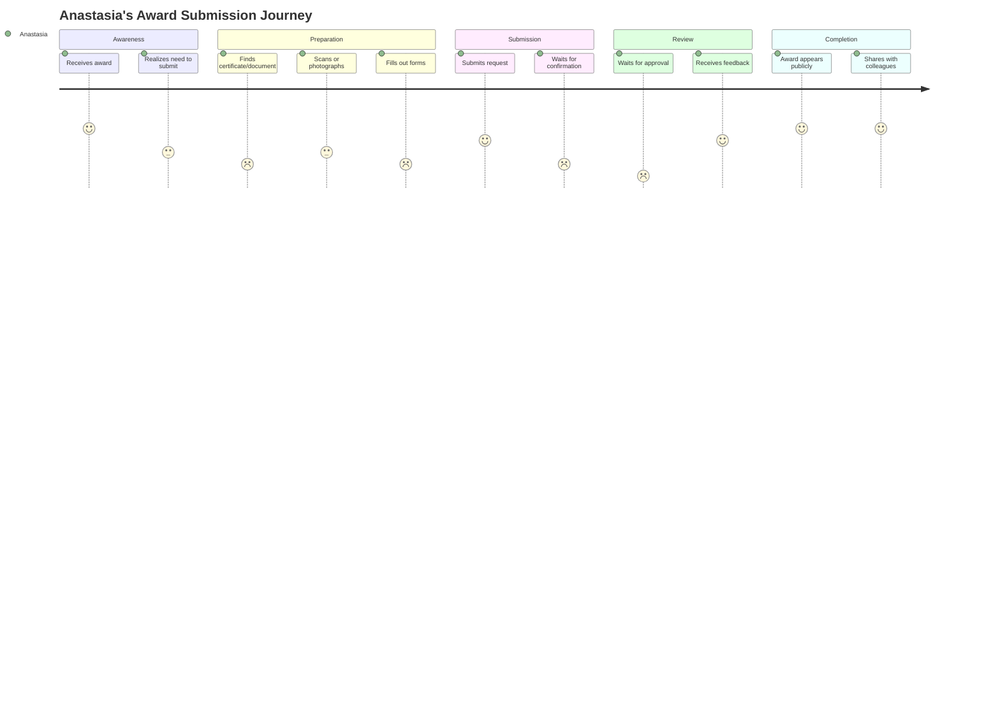
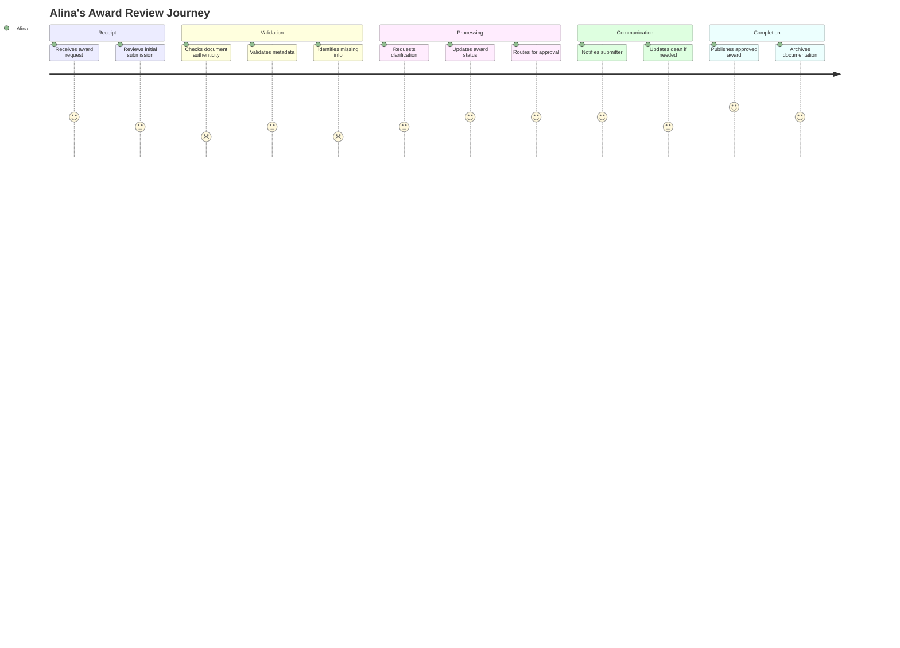
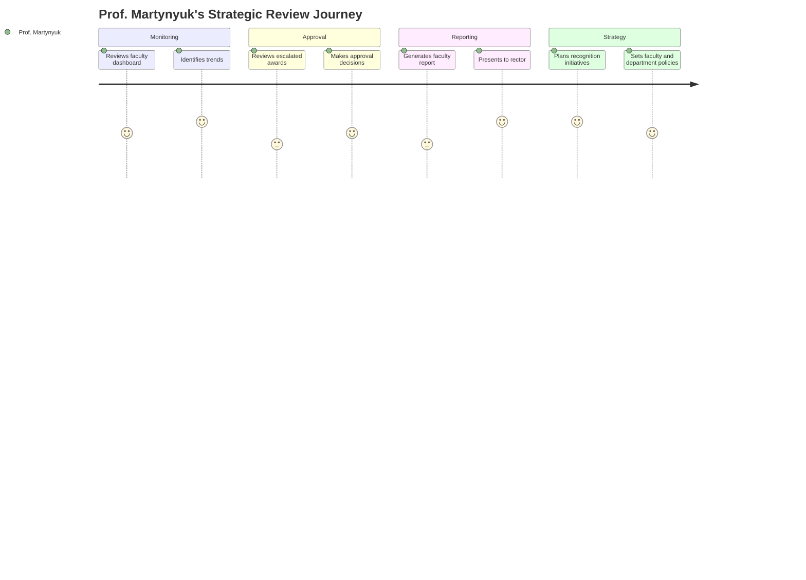
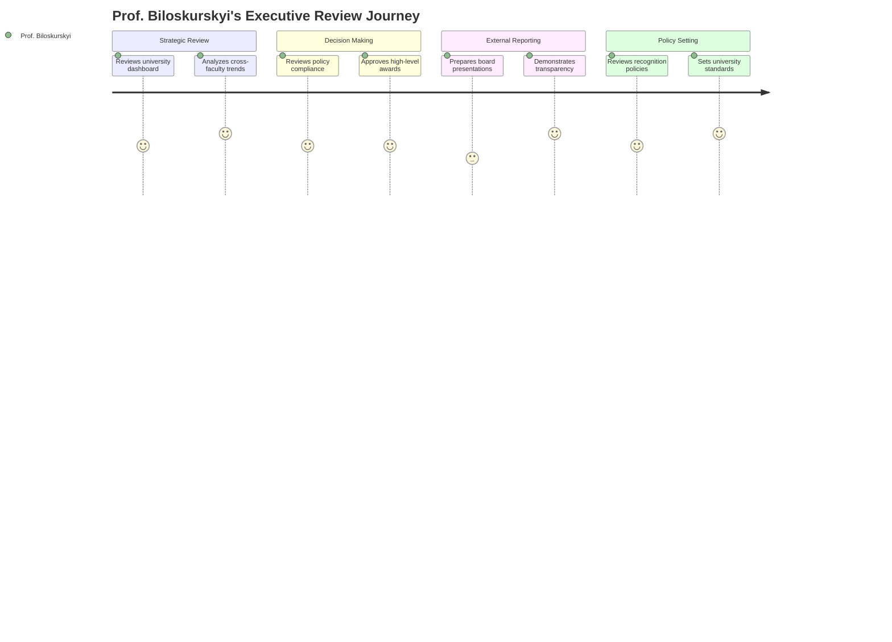

# User Research & Personas: Award Management System

## Executive Summary

This user research analysis defines the primary user personas, journey maps, and pain points for the Award Monitoring & Tracking System. Research is based on **stakeholder analysis** from Phase 2, **Ukrainian university context**, and best practices for academic award management systems.

**Key Findings:**
- **4 Primary Personas** identified across executive, management, and operational levels
- **Major Pain Points**: Manual processes, lack of transparency, GDPR compliance gaps
- **Critical User Journey**: Award submission → Review → Approval → Public visibility
- **Success Factors**: Intuitive interface, mobile access, automated workflows

---

## 1. Research Methodology

### 1.1 Research Approach
Given the **solo developer** and **portfolio project** context, this research combines:

| **Method** | **Application** | **Source** | **Validation** |
|------------|-----------------|------------|----------------|
| **Stakeholder Analysis** | Primary persona definition | Phase 2 stakeholder register | Existing project documentation |
| **Academic Literature** | Best practices research | University management studies | Industry reports |
| **Competitive Analysis** | Feature gap identification | Phase 3 competitive research | Market standard comparison |
| **Cultural Context** | Ukrainian university structure | Local institutional knowledge | Subject matter expertise |

### 1.2 Research Limitations
- **No direct interviews** (solo developer, pre-development phase)
- **Based on secondary research** and stakeholder documentation
- **Assumptions validated** through literature and competitive analysis
- **Future validation planned** through stakeholder feedback sessions

---

## 2. Primary User Personas

### 2.1 Persona 1: Anastasia Yuriychuk - The Active Faculty Member

#### **Demographics**
- **Age**: 34
- **Role**: associate Dean of Information and Media Technology, Department of Applied Mathematics
- **Experience**: 11 years as assistant of the Department of Applied Mathematics
- **Location**: Chernivtsi, Ukraine
- **Tech Proficiency**: Intermediate (comfortable with email, basic software)

#### **Goals & Motivations**
- **Primary Goal**: Efficiently track and showcase professional achievements
- **Career Motivation**: Build reputation for promotions and research opportunities
- **Institutional Goal**: Contribute to university ranking and recognition
- **Personal Motivation**: Pride in accomplishments, peer recognition

#### **Pain Points & Frustrations**
- **Current Process**: Manual spreadsheet tracking, lost certificates
- **Time Consumption**: 2-3 hours monthly on award documentation
- **Lack of Visibility**: No way to see department/university award trends
- **Documentation Burden**: Scanning, emailing, re-entering same information
- **Status Uncertainty**: No tracking of approval status or delays

#### **Technology Proficiency**
- **Comfort Level**: Intermediate user
- **Preferred Devices**: Desktop for work, smartphone for quick access
- **Software Experience**: Microsoft Office, email, basic web applications
- **Learning Style**: Prefers guided tutorials and help documentation

#### **User Journey Map**


#### **Acceptance Criteria Preferences**
- "I want to submit an award in under 5 minutes"
- "I need to see the status of my submissions at any time"
- "I want mobile access to check progress"
- "I need help with document scanning and upload"

---

### 2.2 Persona 2: Alina Skorolitnia - The Faculty Secretary

#### **Demographics**
- **Age**: 28
- **Role**: Faculty Secretary, Faculty of Mathematics and Computer Science
- **Experience**: 5 years in university administration
- **Location**: Chernivtsi, Ukraine
- **Tech Proficiency**: Advanced (database management, multiple systems)

#### **Goals & Motivations**
- **Primary Goal**: Process award requests efficiently and accurately
- **Efficiency Goal**: Reduce manual administrative work by 70%+
- **Quality Goal**: Ensure complete and accurate award records
- **Department Goal**: Support faculty success and recognition

#### **Pain Points & Frustrations**
- **Volume Overload**: 15-20 award requests monthly during peak periods
- **Manual Verification**: Time-consuming document and metadata validation
- **Communication Burden**: Constant emails about status updates
- **Error Prone**: Manual data entry leads to mistakes and rework
- **Approval Bottlenecks**: Waiting for dean/rector approval on complex cases

#### **Technology Proficiency**
- **Comfort Level**: Advanced user
- **Preferred Devices**: Desktop workstation, tablet for reviews
- **Software Experience**: Database systems, document management, spreadsheets
- **Learning Style**: Hands-on training, prefers efficiency shortcuts

#### **User Journey Map**


#### **Acceptance Criteria Preferences**
- "I want to process multiple awards in batch operations"
- "I need automated validation to catch common errors"
- "I want templates for common feedback messages"
- "I need dashboard showing my review queue and metrics"

---

### 2.3 Persona 3: Prof. Martynyuk - The Dean

#### **Demographics**
- **Age**: 49
- **Role**: Dean, Faculty of Mathematics and Computer Science
- **Experience**: 20+ years in academic leadership
- **Location**: Chernivtsi, Ukraine
- **Tech Proficiency**: Intermediate (strategic use, delegates technical tasks)

#### **Goals & Motivations**
- **Strategic Goal**: Enhance faculty reputation and ranking
- **Management Goal**: Oversee fair and transparent award processes
- **Reporting Goal**: Demonstrate faculty achievements to university leadership
- **Quality Goal**: Maintain high standards for award recognition

#### **Pain Points & Frustrations**
- **Limited Visibility**: No real-time overview of faculty achievements
- **Reporting Burden**: Manual compilation of achievement reports
- **Process Inconsistency**: Different approaches across departments
- **Strategic Gaps**: Difficulty identifying recognition trends and opportunities
- **Compliance Concerns**: GDPR and institutional policy adherence

#### **Technology Proficiency**
- **Comfort Level**: Intermediate user
- **Preferred Devices**: Desktop for detailed work, mobile for quick reviews
- **Software Experience**: Email, document editing, presentation software
- **Learning Style**: Executive briefings, summary dashboards

#### **User Journey Map**


#### **Acceptance Criteria Preferences**
- "I want executive dashboard showing faculty performance"
- "I need one-click report generation for university meetings"
- "I want to approve/reject awards from my mobile device"
- "I need trend analysis to guide recognition strategy"

---

### 2.4 Persona 4: Prof. Biloskurskyi - The Rector

#### **Demographics**
- **Age**: 47
- **Role**: Rector, Chernivtsi National University
- **Experience**: 10+ years in academic leadership
- **Location**: Chernivtsi, Ukraine
- **Tech Proficiency**: Basic-Intermediate (strategic overview, assisted usage)

#### **Goals & Motivations**
- **Institutional Goal**: Enhance university reputation and transparency
- **Strategic Goal**: Data-driven decision making for recognition policies
- **Compliance Goal**: Ensure full regulatory adherence (GDPR, national standards)
- **Efficiency Goal**: Reduce administrative overhead across all faculties

#### **Pain Points & Frustrations**
- **Limited University-wide Visibility**: No consolidated view of achievements
- **Manual Reporting**: Time-consuming preparation for board meetings
- **Compliance Risks**: Uncertainty about GDPR adherence
- **Resource Allocation**: Difficulty identifying high-performing areas
- **Transparency Demands**: Pressure for institutional accountability

#### **Technology Proficiency**
- **Comfort Level**: Basic-Intermediate user
- **Preferred Devices**: Desktop for detailed review, mobile for alerts
- **Software Experience**: Email, document review, presentation viewing
- **Learning Style**: Executive summaries, visual dashboards

#### **User Journey Map**


#### **Acceptance Criteria Preferences**
- "I want university-wide performance dashboard"
- "I need compliance reports showing GDPR adherence"
- "I want mobile alerts for awards requiring rector approval"
- "I need presentation-ready reports for board meetings"

---

## 3. User Journey Analysis

### 3.1 Complete Award Lifecycle Journey

#### **Stage 1: Award Recognition**
- **Trigger**: Employee receives external award or achievement
- **Actions**: Recognition, document collection, decision to submit
- **Pain Points**: Unclear submission requirements, lost documents
- **Opportunities**: Clear guidelines, document templates, mobile capture

#### **Stage 2: Submission Process**
- **Actions**: Form completion, document upload, metadata entry
- **Pain Points**: Complex forms, poor mobile experience, unclear requirements
- **Opportunities**: Smart forms, document parsing, progress saving

#### **Stage 3: Review & Validation**
- **Actions**: Administrative review, validation, escalation decisions
- **Pain Points**: Manual verification, communication gaps, bottlenecks
- **Opportunities**: Automated validation, workflow management, notifications

#### **Stage 4: Approval & Publishing**
- **Actions**: Management approval, final publishing, stakeholder notification
- **Pain Points**: Approval delays, limited visibility, manual notifications
- **Opportunities**: Automated workflows, real-time status, batch operations

#### **Stage 5: Recognition & Analytics**
- **Actions**: Public visibility, achievement sharing, trend analysis
- **Pain Points**: Limited analytics, poor discovery, no sharing tools
- **Opportunities**: Rich dashboards, social sharing, predictive analytics

### 3.2 Critical User Paths

#### **High-Frequency Path: Standard Award Submission**
```
Employee Recognition → Mobile Submission → Automated Parsing → 
Secretary Review → Dean Approval → Public Publication
```
- **Frequency**: 60-70% of all awards
- **Success Criteria**: <5 minutes submission, <7 days approval
- **Optimization**: Mobile-first design, smart defaults, batch approvals

#### **Complex Path: University-Level Award**
```
High-Profile Award → Detailed Documentation → Multi-Level Review → 
Rector Approval → Public Announcement → External Reporting
```
- **Frequency**: 10-15% of all awards
- **Success Criteria**: Complete audit trail, <14 days approval
- **Optimization**: Executive dashboards, approval notifications, reporting tools

#### **Exception Path: Appeal & Correction**
```
Rejection/Error → Appeal Submission → Secondary Review → 
Correction/Approval → Updated Publication
```
- **Frequency**: 5-10% of submissions
- **Success Criteria**: Clear appeal process, <5 days resolution
- **Optimization**: Structured feedback, version control, change notifications

---

## 4. Pain Point Analysis

### 4.1 Current State Pain Points

#### **Administrative Burden (High Impact)**
- **Problem**: 320+ hours monthly across university for manual award processing
- **Root Cause**: Paper-based processes, manual data entry, email coordination
- **User Impact**: Faculty secretaries spend 20% of time on award administration
- **Solution Opportunity**: 80% automation through digital workflows

#### **Lack of Transparency (Medium-High Impact)**
- **Problem**: No visibility into award status, approval timelines, or institutional trends
- **Root Cause**: Isolated spreadsheets, email-based communication
- **User Impact**: Frustration, duplicate inquiries, missed opportunities
- **Solution Opportunity**: Real-time dashboards, status tracking, public transparency

#### **GDPR Compliance Gaps (High Impact)**
- **Problem**: Uncertain data handling, retention policies, consent management
- **Root Cause**: Legacy systems, manual processes, unclear policies
- **User Impact**: Legal risk, audit findings, operational uncertainty
- **Solution Opportunity**: Built-in compliance, automated retention, audit trails

#### **Poor Mobile Experience (Medium Impact)**
- **Problem**: Desktop-only access, poor mobile interfaces
- **Root Cause**: Legacy systems designed for desktop use
- **User Impact**: Delayed submissions, poor user adoption
- **Solution Opportunity**: Mobile-first PWA, responsive design

### 4.2 User-Specific Pain Points

#### **Faculty Members (Anastasia Persona)**
- **Time Waste**: Repeated data entry across multiple forms
- **Status Uncertainty**: No tracking of submission progress
- **Document Management**: Scanning, storing, finding certificates
- **Recognition Delay**: Slow approval processes reduce achievement impact

#### **Faculty Secretaries (Alina Persona)**
- **Volume Overload**: Manual processing of high-volume requests
- **Validation Burden**: Time-consuming document and data verification
- **Communication Overhead**: Constant status update requests
- **Error Prone**: Manual processes lead to mistakes and rework

#### **Deans (Prof. Martynyuk Persona)**
- **Limited Visibility**: No real-time faculty performance overview
- **Reporting Burden**: Manual compilation of achievement reports
- **Strategic Gaps**: Difficulty identifying trends and opportunities
- **Approval Bottlenecks**: Manual approval processes cause delays

#### **Rector (Prof. Biloskurskyi Persona)**
- **University-wide Blindness**: No consolidated achievement visibility
- **Compliance Uncertainty**: GDPR and policy adherence unclear
- **External Reporting**: Manual preparation for board presentations
- **Resource Allocation**: Difficulty identifying high-performing areas

---

## 5. User Experience Requirements

### 5.1 Functional Requirements by Persona

#### **Faculty Members**
| **Requirement** | **Priority** | **Acceptance Criteria** |
|-----------------|--------------|-------------------------|
| **Quick Submission** | High | Complete submission in <5 minutes |
| **Status Tracking** | High | Real-time progress visibility |
| **Mobile Access** | High | Full functionality on mobile devices |
| **Document Help** | Medium | Guided document capture and upload |
| **Achievement Showcase** | Medium | Personal achievement dashboard |

#### **Faculty Secretaries**
| **Requirement** | **Priority** | **Acceptance Criteria** |
|-----------------|--------------|-------------------------|
| **Batch Operations** | High | Process multiple awards simultaneously |
| **Automated Validation** | High | Catch common errors automatically |
| **Dashboard Management** | High | Real-time review queue visibility |
| **Template Communication** | Medium | Standardized feedback messages |
| **Performance Metrics** | Medium | Personal productivity tracking |

#### **Deans**
| **Requirement** | **Priority** | **Acceptance Criteria** |
|-----------------|--------------|-------------------------|
| **Executive Dashboard** | High | Faculty performance overview |
| **Mobile Approval** | High | Approve awards from mobile device |
| **Report Generation** | High | One-click performance reports |
| **Trend Analysis** | Medium | Historical and predictive insights |
| **Policy Management** | Medium | Configure faculty-specific rules |

#### **Rector**
| **Requirement** | **Priority** | **Acceptance Criteria** |
|-----------------|--------------|-------------------------|
| **University Dashboard** | High | Institution-wide performance view |
| **Compliance Reporting** | High | GDPR and policy compliance status |
| **Board Presentations** | High | Presentation-ready performance reports |
| **Mobile Alerts** | Medium | High-priority approval notifications |
| **Strategic Analytics** | Medium | Cross-faculty trend analysis |

### 5.2 Non-Functional Requirements

#### **Usability**
- **Learning Curve**: New users productive within 30 minutes
- **Task Efficiency**: 80% reduction in time-to-complete common tasks
- **Error Reduction**: 90% reduction in data entry errors
- **Accessibility**: WCAG AA compliance for all user interfaces

#### **Performance**
- **Response Time**: <2 seconds for all standard operations
- **Mobile Performance**: Lighthouse score >90 on mobile devices
- **Offline Capability**: Basic functionality available offline (PWA)
- **Scalability**: Support 1000+ concurrent users during peak periods

#### **Reliability**
- **Uptime**: 99.9% availability during business hours
- **Data Integrity**: Zero data loss, complete audit trails
- **Error Recovery**: Graceful degradation and error messaging
- **Backup**: Real-time data backup and disaster recovery

---

## 6. Design Implications

### 6.1 Interface Design Principles

#### **Mobile-First Design**
- **Primary Access**: Design for mobile, enhance for desktop
- **Touch Interactions**: Large buttons, swipe gestures, voice input
- **Progressive Enhancement**: Core functionality on all devices
- **Offline Support**: PWA capabilities for poor connectivity

#### **Accessibility-First**
- **Screen Readers**: Full compatibility with assistive technologies
- **Keyboard Navigation**: Complete keyboard accessibility
- **Visual Design**: High contrast, scalable fonts, color-blind friendly
- **Multilingual**: Ukrainian and English interface support

#### **Task-Oriented Design**
- **User Goals**: Design around primary user tasks
- **Workflow Optimization**: Minimize clicks and cognitive load
- **Context Preservation**: Save progress, remember preferences
- **Error Prevention**: Proactive validation and helpful messaging

### 6.2 Feature Prioritization Matrix

| **Feature** | **User Value** | **Implementation Effort** | **Priority** |
|-------------|----------------|---------------------------|--------------|
| **Award Submission Form** | Very High | Medium | P0 (MVP) |
| **Status Tracking** | Very High | Low | P0 (MVP) |
| **Mobile Responsive Design** | High | Medium | P0 (MVP) |
| **Document Upload/Parsing** | High | High | P1 (Phase 2) |
| **Administrative Dashboard** | High | Medium | P1 (Phase 2) |
| **Executive Analytics** | Medium | High | P2 (Phase 3) |
| **Advanced Reporting** | Medium | High | P2 (Phase 3) |
| **API Integration** | Low | Medium | P3 (Future) |

---

## 7. Validation & Testing Strategy

### 7.1 User Testing Plan

#### **Prototype Testing**
- **Method**: Interactive prototypes with key stakeholders
- **Participants**: 2-3 representatives from each persona group
- **Focus**: Core user flows, interface usability, feature completeness
- **Timeline**: Post-design, pre-development

#### **Beta Testing**
- **Method**: Limited production deployment with select faculty
- **Participants**: Single department (Applied Mathematics)
- **Focus**: Real-world usage, performance, integration issues
- **Timeline**: Post-MVP development

#### **Usability Testing**
- **Method**: Task-based testing sessions
- **Metrics**: Task completion rate, time-to-complete, error rate
- **Focus**: Interface design, workflow optimization
- **Timeline**: Iterative throughout development

### 7.2 Success Metrics

#### **Adoption Metrics**
- **User Registration**: 90% of eligible users within 6 months
- **Active Usage**: 70% weekly active users after onboarding
- **Feature Adoption**: 80% users engage with core features monthly

#### **Efficiency Metrics**
- **Time Savings**: 80% reduction in award processing time
- **Error Reduction**: 90% fewer data entry errors
- **User Satisfaction**: 4.5/5.0 average user rating

#### **Business Metrics**
- **Administrative Cost**: 70% reduction in administrative overhead
- **Compliance**: 100% GDPR compliance, zero audit findings
- **Transparency**: 100% awards publicly visible within 14 days

---

## 8. Conclusion

The user research reveals clear personas with distinct needs, pain points, and usage patterns. The Award Monitoring & Tracking System must prioritize **mobile accessibility**, **workflow efficiency**, and **transparent communication** to succeed with Ukrainian university stakeholders.

**Key Success Factors:**
1. **Mobile-first design** for faculty and administrative users
2. **Automated workflows** to reduce administrative burden
3. **Real-time visibility** into award status and institutional performance
4. **Intuitive interfaces** that require minimal training
5. **Compliance-ready features** for GDPR and institutional policies

---

*Document Version: 1.0*  
*Created: August 2025*  
*Author: Stefan Kostyk*  