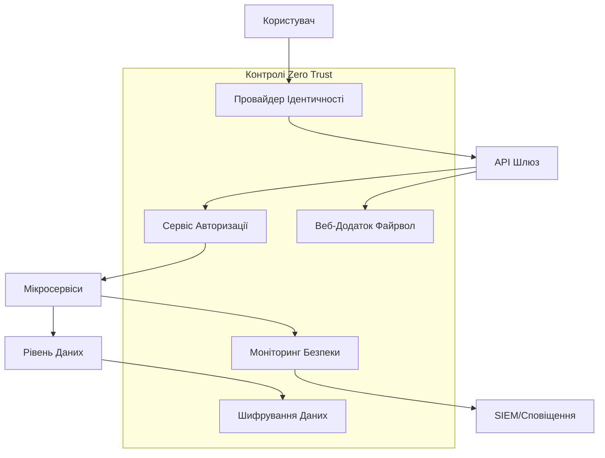
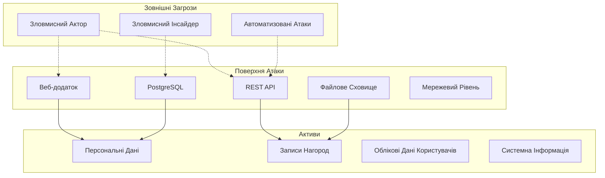

# Реалізація Фреймворку Безпеки: Система Моніторингу та Відстеження Нагород

**Проект**: Система Моніторингу та Відстеження Нагород для Українських Університетів  
**Контекст**: Портфоліо Проект Соло-Розробника (Безкоштовний/Відкритий Код)  
**Версія Фреймворку**: 1.0  
**Дата Вступу в Силу**: Серпень 2025  
**Офіцер з Безпеки**: Стефан Костик (Соло-Розробник)  
**Модель Безпеки**: Архітектура Zero Trust з Моделюванням Загроз STRIDE

---

## Виконавче Резюме

Цей Фреймворк Безпеки впроваджує архітектуру Zero Trust з всебічним моделюванням загроз для Системи Моніторингу та Відстеження Нагород. Фреймворк забезпечує надійну позицію безпеки, відповідну для обробки чутливих академічних даних, зберігаючи при цьому вимоги публічної прозорості.

**Принципи Безпеки**:
- **Zero Trust**: Ніколи не довіряй, завжди перевіряй - немає неявних зон довіри
- **Багаторівневий Захист**: Множинні рівні безпеки та контролі
- **Приватність за Дизайном**: Контролі безпеки, що захищають приватність даних
- **Керований Загрозами**: Методологія STRIDE для систематичної ідентифікації загроз

**Цілі Безпеки**:
- Захистити персональні дані університетських співробітників
- Забезпечити цілісність даних записів нагород
- Підтримувати доступність та продуктивність системи
- Запобігати несанкціонованому доступу та витокам даних

---

## 1. Реалізація Архітектури Zero Trust

### **1.1 Принципи Zero Trust**

| **Принцип** | **Реалізація** | **Технологія** | **Метод Верифікації** |
|-------------|----------------|----------------|----------------------|
| **Явна Верифікація** | Багатофакторна автентифікація, валідація пристроїв | OAuth2 + JWT + MFA | Валідація токенів, відбитки пристроїв |
| **Доступ з Найменшими Привілеями** | Дозволи на основі ролей, доступ "якраз вчасно" | Spring Security RBAC | Аудит дозволів, перегляди доступу |
| **Припускати Порушення** | Безперервний моніторинг, реагування на інциденти | SIEM, виявлення аномалій | Сповіщення в реальному часі, форензичне логування |
| **Мікросегментація** | Ізоляція сервісів, мережеві контролі | Kubernetes мережеві політики | Інспекція трафіку, сервісна мережа |
| **Безпека, Орієнтована на Дані** | Шифрування, запобігання втраті даних | AES-256, шифрування на рівні полів | Аудит шифрування, класифікація даних |

### **1.2 Компоненти Архітектури Zero Trust**



### **1.3 Управління Ідентичністю та Доступом (IAM)**

```java
// Реалізація Автентифікації Zero Trust
@Configuration
public class ZeroTrustSecurityConfig {
    
    @Bean
    public SecurityFilterChain filterChain(HttpSecurity http) throws Exception {
        return http
            .sessionManagement(session -> 
                session.sessionCreationPolicy(SessionCreationPolicy.STATELESS))
            .oauth2ResourceServer(oauth2 -> oauth2
                .jwt(jwt -> jwt
                    .jwtAuthenticationConverter(jwtAuthenticationConverter())
                    .jwtDecoder(jwtDecoder())))
            .authorizeHttpRequests(authz -> authz
                .requestMatchers("/api/public/**").permitAll()
                .requestMatchers("/api/admin/**").hasRole("ADMIN")
                .anyRequest().authenticated())
            .exceptionHandling(ex -> ex
                .authenticationEntryPoint(authenticationEntryPoint())
                .accessDeniedHandler(accessDeniedHandler()))
            .build();
    }
    
    @Bean
    public JwtAuthenticationConverter jwtAuthenticationConverter() {
        JwtAuthenticationConverter converter = new JwtAuthenticationConverter();
        converter.setJwtGrantedAuthoritiesConverter(jwt -> {
            // Zero Trust: Явне картування дозволів
            List<String> roles = jwt.getClaimAsStringList("roles");
            List<String> permissions = jwt.getClaimAsStringList("permissions");
            
            return Stream.concat(
                roles.stream().map(role -> new SimpleGrantedAuthority("ROLE_" + role)),
                permissions.stream().map(SimpleGrantedAuthority::new)
            ).collect(Collectors.toList());
        });
        return converter;
    }
}

// Безперервна Верифікація Автентифікації
@Component
public class ContinuousAuthenticationService {
    
    @EventListener
    public void verifyRequest(AuthenticationEvent event) {
        Authentication auth = event.getAuthentication();
        
        // Zero Trust: Верифікувати кожен запит
        if (!isTokenValid(auth) || 
            !isDeviceAuthorized(auth) || 
            !isRequestPatternNormal(auth)) {
            
            securityEventPublisher.publishEvent(
                new SuspiciousActivityEvent(auth, "Невдача безперервної автентифікації"));
            throw new AuthenticationException("Безперервна верифікація невдала");
        }
        
        // Оновити часову мітку останньої верифікації
        updateLastVerification(auth);
    }
    
    private boolean isRequestPatternNormal(Authentication auth) {
        UserBehaviorProfile profile = behaviorService.getProfile(auth.getName());
        RequestPattern current = RequestPattern.fromRequest();
        
        return behaviorAnalyzer.isPatternNormal(profile, current);
    }
}
```

### **1.4 Стратегія Мікросегментації**

```yaml
# Мережеві Політики Kubernetes - Zero Trust Мережа
apiVersion: networking.k8s.io/v1
kind: NetworkPolicy
metadata:
  name: award-service-policy
  namespace: production
spec:
  podSelector:
    matchLabels:
      app: award-service
  policyTypes:
  - Ingress
  - Egress
  ingress:
  - from:
    - podSelector:
        matchLabels:
          app: api-gateway
    ports:
    - protocol: TCP
      port: 8080
  egress:
  - to:
    - podSelector:
        matchLabels:
          app: database
    ports:
    - protocol: TCP
      port: 5432
  - to:
    - podSelector:
        matchLabels:
          app: redis-cache
    ports:
    - protocol: TCP
      port: 6379

---
# Безпека Сервісної Мережі (Istio)
apiVersion: security.istio.io/v1beta1
kind: PeerAuthentication
metadata:
  name: default
  namespace: production
spec:
  mtls:
    mode: STRICT

---
apiVersion: security.istio.io/v1beta1
kind: AuthorizationPolicy
metadata:
  name: award-service-authz
  namespace: production
spec:
  selector:
    matchLabels:
      app: award-service
  rules:
  - from:
    - source:
        principals: ["cluster.local/ns/production/sa/api-gateway"]
    to:
    - operation:
        methods: ["GET", "POST", "PUT"]
        paths: ["/api/awards/*"]
    when:
    - key: source.ip
      notValues: ["0.0.0.0/0"]
```

---

## 2. Моделювання Загроз STRIDE

### **2.1 Огляд Методології STRIDE**

| **Категорія Загрози** | **Визначення** | **Властивість Безпеки** | **Стратегія Пом'якшення** |
|----------------------|----------------|------------------------|---------------------------|
| **Підробка ідентифікаційної інформації (Spoofing)** | Імітація користувачів або систем | Автентифікація | Багатофакторна автентифікація, валідація сертифікатів |
| **Втручання в дані (Tampering)** | Несанкціонована модифікація даних | Цілісність | Цифрові підписи, контрольні суми, валідація вводу |
| **Відмова (Repudiation)** | Заперечення виконаних дій | Незаперечність | Аудиторське логування, цифрові підписи, часові мітки |
| **Розголошення Інформації** | Несанкціонований доступ до інформації | Конфіденційність | Шифрування, контроль доступу, класифікація даних |
| **Відмова в Обслуговуванні** | Порушення доступності системи | Доступність | Обмеження швидкості, моніторинг ресурсів, резервування |
| **Підвищення Привілеїв** | Отримання несанкціонованих дозволів | Авторизація | Найменші привілеї, валідація ролей, аудит дозволів |

### **2.2 Модель Загроз Системної Архітектури**



### **2.3 Матриця Аналізу Загроз STRIDE**

| **Компонент** | **Підробка ідентифікаційної інформації** | **Втручання в дані** | **Відмова** | **Розголошення Інформації** | **Відмова в обслуговуванні** | **Підвищення Привілехв** |
|---------------|--------------|-------------|-----------------|-------------------|---------|---------------|
| **Веб Фронтенд** | ❌ Захоплення сесії | ❌ XSS атаки | ✅ Відстеження користувачів | ❌ Витік даних | ❌ DDoS | ❌ CSRF |
| **API Шлюз** | ❌ Підробка токенів | ❌ Маніпуляція запитів | ✅ Логування запитів | ❌ Перелік API | ❌ Обхід обмеження швидкості | ❌ Обхід автентифікації |
| **Сервіс Автентифікації** | ❌ Крадіжка облікових даних | ❌ Підміна токенів | ✅ Логування автентифікації | ❌ Витік облікових даних | ❌ Флуд автентифікації | ❌ Ескалація привілеїв |
| **База Даних** | ❌ SQL ін'єкції | ❌ Пошкодження даних | ✅ Журнали транзакцій | ❌ Дампи даних | ❌ Вичерпання з'єднань | ❌ Обхід дозволів |
| **Файлове Сховище** | ❌ Обхід шляхів | ❌ Пошкодження файлів | ✅ Логування доступу | ❌ Несанкціонований доступ | ❌ Вичерпання сховища | ❌ Ескалація дозволів |

**Легенда**: ❌ = Загроза Присутня, ✅ = Пом'якшено

### **2.4 Детальний Аналіз Загроз**

#### **2.4.1 Загрози Підробка Ідентифікаційної Інформації**

| **ID Загрози** | **Загроза** | **Вплив** | **Ймовірність** | **Оцінка Ризику** | **Пом'якшення** |
|----------------|-------------|------------|-----------------|-------------------|-----------------|
| **S001** | Підробка ідентичності користувача через вкрадені облікові дані | Високий | Середня | 8 | MFA, верифікація пристроїв, поведінковий аналіз |
| **S002** | Підробка ідентичності сервісу в мікросервісах | Високий | Низька | 6 | mTLS, сертифікати сервісів, сервісна мережа |
| **S003** | Імітація адміністраторського облікового запису | Критичний | Низька | 9 | Апаратні ключі безпеки, робочі процеси схвалення адміністратора |
| **S004** | Підробка API клієнта | Середній | Середня | 6 | Валідація API ключів, клієнтські сертифікати |

#### **2.4.2 Загрози Втручання в Дані**

| **ID Загрози** | **Загроза** | **Вплив** | **Ймовірність** | **Оцінка Ризику** | **Пом'якшення** |
|----------------|-------------|------------|-----------------|-------------------|-----------------|
| **T001** | Маніпуляція даними нагород | Високий | Низька | 6 | Цифрові підписи, аудиторські сліди, робочі процеси схвалення |
| **T002** | Підміна профілю користувача | Середній | Середня | 6 | Валідація вводу, аудит змін, дозволи ролей |
| **T003** | Зміни конфігурації системи | Високий | Низька | 6 | Незмінність конфігурації, схвалення змін |
| **T004** | Модифікація записів бази даних | Критичний | Низька | 9 | Цілісність на рівні бази даних, контрольні суми, реплікація |

#### **2.4.3 Загрози Розголошення Інформації**

| **ID Загрози** | **Загроза** | **Вплив** | **Ймовірність** | **Оцінка Ризику** | **Пом'якшення** |
|----------------|-------------|------------|-----------------|-------------------|-----------------|
| **I001** | Витік персональних даних через API | Високий | Середня | 8 | Класифікація даних, шифрування на рівні полів, контроль доступу |
| **I002** | Несанкціонований доступ до документів нагород | Середній | Середня | 6 | Контроль доступу до документів, водяні знаки, аудиторське логування |
| **I003** | Витік системної інформації | Низький | Висока | 5 | Санітизація повідомлень про помилки, заголовки безпеки |
| **I004** | Витік резервних копій бази даних | Критичний | Низька | 9 | Шифрування резервних копій, безпечне зберігання, контроль доступу |

### **2.5 Реалізація Пом'якшення Загроз**

```java
// Всебічний Сервіс Безпеки
@Service
public class ThreatMitigationService {
    
    // S001: Пом'якшення Підробки - Поведінковий Аналіз
    @EventListener
    public void analyzeUserBehavior(UserActionEvent event) {
        UserBehaviorProfile profile = behaviorService.getProfile(event.getUserId());
        ActionPattern currentPattern = ActionPattern.from(event);
        
        if (behaviorAnalyzer.isAnomalous(profile, currentPattern)) {
            securityEventPublisher.publishEvent(
                new AnomalousActivityEvent(event.getUserId(), currentPattern));
            
            // Вимагати додаткову верифікацію
            authenticationService.requireReAuthentication(event.getUserId());
        }
    }
    
    // T001: Пом'якшення Підміни - Цілісність Даних
    @EventListener
    public void validateDataIntegrity(DataModificationEvent event) {
        String expectedChecksum = checksumService.calculateChecksum(event.getOriginalData());
        String actualChecksum = event.getDataChecksum();
        
        if (!expectedChecksum.equals(actualChecksum)) {
            auditService.logSecurityEvent(
                SecurityEventType.DATA_TAMPERING_DETECTED, 
                event.getUserId(), 
                event.getResourceId());
            
            throw new DataIntegrityException("Виявлено підміну даних");
        }
    }
    
    // I001: Пом'якшення Розкриття Інформації - Маскування Даних
    @PostFilter("@securityService.canViewSensitiveData(authentication, filterObject)")
    public List<UserProfile> searchUsers(String query) {
        List<UserProfile> results = userService.search(query);
        
        return results.stream()
            .map(profile -> maskSensitiveData(profile, getCurrentUser()))
            .collect(Collectors.toList());
    }
    
    private UserProfile maskSensitiveData(UserProfile profile, User viewer) {
        if (!securityService.canViewPersonalData(viewer, profile.getUserId())) {
            profile.setEmail("***@***.***");
            profile.setPhone("***-***-****");
            profile.setAddress(null);
        }
        return profile;
    }
}
```

---

## 3. Реалізація Контролів Безпеки

### **3.1 Автентифікація та Авторизація**

```java
// Реалізація Багатофакторної Автентифікації
@Service
public class MultiFactorAuthService {
    
    public AuthenticationResult authenticate(LoginRequest request) {
        // Первинна автентифікація
        User user = validateCredentials(request.getUsername(), request.getPassword());
        
        // Оцінка ризику
        RiskScore riskScore = riskAssessmentService.calculateRisk(user, request);
        
        if (riskScore.requiresMFA()) {
            // Ініціювати виклик MFA
            MFAChallenge challenge = mfaService.createChallenge(user);
            return AuthenticationResult.requiresMFA(challenge);
        }
        
        // Згенерувати безпечну сесію
        JwtToken token = jwtService.generateToken(user);
        sessionService.createSession(user, token, request.getDeviceInfo());
        
        return AuthenticationResult.success(token);
    }
    
    public boolean validateMFA(String userId, String challengeId, String response) {
        MFAChallenge challenge = mfaService.getChallenge(challengeId);
        
        if (challenge.isExpired() || !challenge.getUserId().equals(userId)) {
            auditService.logSecurityEvent(
                SecurityEventType.MFA_VALIDATION_FAILED, userId, challengeId);
            return false;
        }
        
        return switch (challenge.getType()) {
            case TOTP -> totpValidator.validate(challenge.getSecret(), response);
            case SMS -> smsValidator.validate(challenge.getCode(), response);
            case EMAIL -> emailValidator.validate(challenge.getCode(), response);
            case HARDWARE_KEY -> hardwareKeyValidator.validate(challenge.getKeyId(), response);
        };
    }
}
```

### **3.2 Стратегія Шифрування Даних**

```java
// Всебічний Сервіс Шифрування
@Service
public class EncryptionService {
    
    private final KeyManagementService keyService;
    private final AESUtils aesUtils;
    private final RSAUtils rsaUtils;
    
    // Шифрування на рівні полів для чутливих даних
    @EncryptedField(keyType = KeyType.PERSONAL_DATA)
    public String encryptPersonalData(String data, String userId) {
        String dataKey = keyService.getDataEncryptionKey(userId);
        return aesUtils.encrypt(data, dataKey);
    }
    
    // Шифрування документів з користувацькими ключами
    public EncryptedDocument encryptDocument(Document document, String userId) {
        // Згенерувати унікальний ключ документа
        String documentKey = keyService.generateDocumentKey();
        
        // Зашифрувати вміст документа
        byte[] encryptedContent = aesUtils.encrypt(document.getContent(), documentKey);
        
        // Зашифрувати ключ документа публічним ключем користувача
        String userPublicKey = keyService.getUserPublicKey(userId);
        String encryptedKey = rsaUtils.encrypt(documentKey, userPublicKey);
        
        return EncryptedDocument.builder()
            .encryptedContent(encryptedContent)
            .encryptedKey(encryptedKey)
            .keyId(keyService.getKeyId(userId))
            .algorithm("AES-256-GCM")
            .build();
    }
    
    // Ротація ключів для відповідності
    @Scheduled(cron = "0 0 0 1 * ?") // Щомісячна ротація ключів
    public void rotateEncryptionKeys() {
        List<String> expiredKeys = keyService.getExpiredKeys();
        
        for (String keyId : expiredKeys) {
            String newKey = keyService.generateKey();
            reEncryptDataWithNewKey(keyId, newKey);
            keyService.archiveKey(keyId);
        }
    }
}
```

### **3.3 Моніторинг Безпеки та Реагування на Інциденти**

```java
// Виявлення та Реагування на Події Безпеки
@Component
public class SecurityEventProcessor {
    
    @EventListener
    @Async
    public void processSecurityEvent(SecurityEvent event) {
        // Негайна оцінка загроз
        ThreatLevel threatLevel = threatAssessmentService.assess(event);
        
        // Логування до SIEM
        siemService.logEvent(event, threatLevel);
        
        // Автоматизована відповідь на основі рівня загрози
        switch (threatLevel) {
            case CRITICAL -> handleCriticalThreat(event);
            case HIGH -> handleHighThreat(event);
            case MEDIUM -> handleMediumThreat(event);
            case LOW -> handleLowThreat(event);
        }
        
        // Оновити розвідку загроз
        threatIntelligenceService.updateIndicators(event);
    }
    
    private void handleCriticalThreat(SecurityEvent event) {
        // Негайне стримування
        if (event.getUserId() != null) {
            userService.suspendUser(event.getUserId(), "Інцидент безпеки");
        }
        
        // Блокувати IP джерела
        firewallService.blockIP(event.getSourceIP());
        
        // Негайне сповіщення команди безпеки
        alertService.sendCriticalAlert(event);
        
        // Ініціювати реагування на інцидент
        incidentResponseService.createIncident(event, IncidentSeverity.CRITICAL);
    }
    
    private void handleHighThreat(SecurityEvent event) {
        // Додатковий моніторинг
        monitoringService.increaseMonitoring(event.getUserId(), Duration.ofHours(24));
        
        // Вимагати повторну автентифікацію
        if (event.getUserId() != null) {
            authenticationService.invalidateSessions(event.getUserId());
        }
        
        // Сповістити команду безпеки
        alertService.sendHighPriorityAlert(event);
    }
}

// Сервіс Виявлення Аномалій
@Service
public class AnomalyDetectionService {
    
    private final MachineLearningModel behaviorModel;
    
    public AnomalyScore detectAnomaly(UserActivity activity) {
        // Витягування ознак
        ActivityFeatures features = extractFeatures(activity);
        
        // Виявлення аномалій на основі ML
        double anomalyScore = behaviorModel.predict(features);
        
        // Статистичний аналіз
        double statisticalScore = statisticalAnalyzer.analyze(activity);
        
        // Виявлення на основі правил
        double ruleBasedScore = ruleEngine.evaluate(activity);
        
        // Зважений композитний бал
        double finalScore = (anomalyScore * 0.5) + 
                           (statisticalScore * 0.3) + 
                           (ruleBasedScore * 0.2);
        
        return AnomalyScore.builder()
            .overallScore(finalScore)
            .mlScore(anomalyScore)
            .statisticalScore(statisticalScore)
            .ruleBasedScore(ruleBasedScore)
            .threshold(0.8)
            .isAnomalous(finalScore > 0.8)
            .build();
    }
    
    private ActivityFeatures extractFeatures(UserActivity activity) {
        return ActivityFeatures.builder()
            .timeOfDay(activity.getTimestamp().getHour())
            .dayOfWeek(activity.getTimestamp().getDayOfWeek().getValue())
            .actionType(activity.getActionType())
            .resourceType(activity.getResourceType())
            .sourceIP(activity.getSourceIP())
            .userAgent(activity.getUserAgent())
            .sessionDuration(activity.getSessionDuration())
            .requestFrequency(activity.getRequestFrequency())
            .build();
    }
}
```

### **3.4 Управління Уразливостями**

```yaml
# Пайплайн Сканування Безпеки
security_scanning:
  static_analysis:
    tools:
      - sonarqube
      - checkmarx
      - spotbugs
    frequency: every_commit
    thresholds:
      critical: 0
      high: 2
      medium: 10
      
  dependency_scanning:
    tools:
      - owasp_dependency_check
      - snyk
      - npm_audit
    frequency: daily
    auto_update: minor_versions
    
  dynamic_analysis:
    tools:
      - owasp_zap
      - burp_suite
      - nikto
    frequency: weekly
    scope: full_application
    
  infrastructure_scanning:
    tools:
      - nessus
      - openvas
      - qualys
    frequency: monthly
    scope: all_assets
    
  container_scanning:
    tools:
      - clair
      - aqua_security
      - twistlock
    frequency: every_build
    base_images: approved_only
```

---

## 4. Метрики та КПІ Безпеки

### **4.1 Індикатори Продуктивності Безпеки**

| **Метрика** | **Ціль** | **Вимірювання** | **Частота** | **Поріг Сповіщення** |
|-------------|----------|-----------------|-------------|---------------------|
| **Середній Час до Виявлення (MTTD)** | < 5 хвилин | Часова мітка сповіщення - часова мітка інциденту | В реальному часі | > 10 хвилин |
| **Середній Час до Відповіді (MTTR)** | < 30 хвилин | Часова мітка відповіді - часова мітка виявлення | В реальному часі | > 60 хвилин |
| **Коефіцієнт Хибних Спрацьовувань** | < 5% | Хибні спрацьовування / Загальні сповіщення | Щоденно | > 10% |
| **Час Усунення Уразливостей** | < 7 днів (критичні) | Часова мітка виправлення - часова мітка виявлення | Щотижнево | > 14 днів |
| **Завершення Навчання з Безпеки** | 100% | Навчені користувачі / Загальні користувачі | Щомісячно | < 95% |
| **Час Стримування Інциденту** | < 1 година | Стримування - виявлення | За інцидент | > 2 години |

### **4.2 Матриця Оцінки Ризику**

| **Рівень Ризику** | **Діапазон Балів** | **Час Відповіді** | **Ескалація** | **Потрібне Схвалення** |
|-------------------|-------------------|-------------------|---------------|------------------------|
| **Критичний** | 9-10 | Негайно | CISO, Керівництво | Командир Інциденту |
| **Високий** | 7-8 | 1 година | Команда Безпеки | Менеджер Безпеки |
| **Середній** | 4-6 | 4 години | Аналітик Безпеки | Керівник Команди |
| **Низький** | 1-3 | 24 години | Автоматизовано | Немає |

---

## 5. Відповідність та Аудит

### **5.1 Фреймворк Відповідності Безпеки**

```java
// Моніторинг Відповідності Безпеки
@Service
public class SecurityComplianceService {
    
    @Scheduled(cron = "0 0 2 * * ?") // Щоденна перевірка відповідності
    public void performComplianceAudit() {
        ComplianceReport report = ComplianceReport.builder()
            .auditDate(LocalDate.now())
            .encryptionCompliance(auditEncryptionStandards())
            .accessControlCompliance(auditAccessControls())
            .incidentResponseCompliance(auditIncidentResponse())
            .vulnerabilityManagement(auditVulnerabilityManagement())
            .securityTraining(auditSecurityTraining())
            .build();
            
        if (report.hasViolations()) {
            complianceAlertService.sendAlert(report);
        }
        
        complianceRepository.save(report);
    }
    
    private EncryptionComplianceResult auditEncryptionStandards() {
        List<DataAsset> unencryptedAssets = dataAssetService.findUnencryptedSensitiveData();
        List<WeakEncryption> weakEncryptions = encryptionService.findWeakEncryptions();
        
        return EncryptionComplianceResult.builder()
            .totalSensitiveAssets(dataAssetService.countSensitiveAssets())
            .encryptedAssets(dataAssetService.countEncryptedAssets())
            .unencryptedAssets(unencryptedAssets.size())
            .weakEncryptions(weakEncryptions.size())
            .compliancePercentage(calculateEncryptionCompliance())
            .violations(mergeViolations(unencryptedAssets, weakEncryptions))
            .build();
    }
}
```

### **5.2 Аудиторський Слід Безпеки**

```sql
-- Схема Логування Подій Безпеки
CREATE TABLE security_events (
    id BIGSERIAL PRIMARY KEY,
    event_type VARCHAR(100) NOT NULL,
    severity VARCHAR(20) NOT NULL,
    user_id BIGINT REFERENCES users(id),
    source_ip INET NOT NULL,
    user_agent TEXT,
    resource_id VARCHAR(200),
    action VARCHAR(100) NOT NULL,
    outcome VARCHAR(50) NOT NULL,
    threat_indicators JSONB,
    event_timestamp TIMESTAMP WITH TIME ZONE DEFAULT CURRENT_TIMESTAMP,
    processing_timestamp TIMESTAMP WITH TIME ZONE DEFAULT CURRENT_TIMESTAMP,
    correlation_id UUID DEFAULT gen_random_uuid(),
    
    INDEX idx_security_events_timestamp (event_timestamp),
    INDEX idx_security_events_user (user_id),
    INDEX idx_security_events_type (event_type),
    INDEX idx_security_events_severity (severity)
);

-- Аудит Контролю Доступу
CREATE TABLE access_control_audit (
    id BIGSERIAL PRIMARY KEY,
    user_id BIGINT NOT NULL,
    resource_type VARCHAR(100) NOT NULL,
    resource_id VARCHAR(200) NOT NULL,
    permission VARCHAR(100) NOT NULL,
    access_granted BOOLEAN NOT NULL,
    access_reason VARCHAR(500),
    risk_score DECIMAL(3,2),
    audit_timestamp TIMESTAMP WITH TIME ZONE DEFAULT CURRENT_TIMESTAMP
);
```

---

## 6. Навчання з Безпеки та Усвідомлення

### **6.1 Програма Навчання з Безпеки**

| **Роль** | **Навчальні Модулі** | **Тривалість** | **Частота** | **Оцінка** |
|----------|---------------------|----------------|-------------|------------|
| **Всі Користувачі** | Основи безпеки, усвідомлення фішингу, безпека паролів | 2 години | Річно | Тест на прохід/провал |
| **Розробники** | Безпечне кодування, OWASP Top 10, моделювання загроз | 8 годин | Річно | Практична оцінка |
| **Адміністратори** | Безпека інфраструктури, реагування на інциденти | 4 години | Річно | Тест на основі сценаріїв |
| **Офіцер з Відповідності** | Регуляторні вимоги, процедури аудиту | 6 годин | Річно | Іспит на сертифікацію |

### **6.2 Метрики Усвідомлення Безпеки**

```java
// Відстеження Навчання з Безпеки
@Service
public class SecurityTrainingService {
    
    public TrainingComplianceReport generateComplianceReport() {
        List<User> allUsers = userService.getAllUsers();
        
        Map<String, TrainingStats> statsByRole = allUsers.stream()
            .collect(Collectors.groupingBy(
                User::getRole,
                Collectors.collectingAndThen(
                    Collectors.toList(),
                    this::calculateTrainingStats
                )
            ));
        
        return TrainingComplianceReport.builder()
            .reportDate(LocalDate.now())
            .overallComplianceRate(calculateOverallCompliance(statsByRole))
            .statsByRole(statsByRole)
            .overdueTraining(findOverdueTraining(allUsers))
            .upcomingDeadlines(findUpcomingDeadlines(allUsers))
            .build();
    }
    
    private TrainingStats calculateTrainingStats(List<User> users) {
        int total = users.size();
        int completed = (int) users.stream()
            .filter(this::hasCompletedRequiredTraining)
            .count();
        int overdue = (int) users.stream()
            .filter(this::hasOverdueTraining)
            .count();
            
        return TrainingStats.builder()
            .totalUsers(total)
            .completedTraining(completed)
            .overdueTraining(overdue)
            .complianceRate((double) completed / total * 100)
            .build();
    }
}
```

---

## 7. План Реагування на Інциденти

### **7.1 Процедури Реагування на Інциденти**

| **Фаза** | **Цілі** | **Дії** | **Відповідальний** | **Часова Лінія** |
|----------|----------|---------|--------------------|------------------|
| **Підготовка** | Готовність до інцидентів | Навчання команди, плейбуки, інструменти | Команда Безпеки | Постійно |
| **Виявлення** | Ідентифікація інцидентів безпеки | Моніторинг, сповіщення, аналіз | SOC/SIEM | В реальному часі |
| **Стримування** | Обмеження впливу інциденту | Ізоляція систем, збереження доказів | Команда Реагування на Інциденти | < 1 година |
| **Розслідування** | Визначення обсягу інциденту | Форензичний аналіз, коренева причина | Аналітики Безпеки | 1-3 дні |
| **Відновлення** | Відновлення нормальних операцій | Відновлення системи, валідація | Операційна Команда | Змінно |
| **Уроки** | Покращення позиції безпеки | Документація, оновлення процесів | Всі Команди | 1 тиждень після інциденту |

### **7.2 Класифікація Інцидентів**

```java
// Класифікація та Реагування на Інциденти
@Service
public class IncidentClassificationService {
    
    public IncidentClassification classifyIncident(SecurityEvent event) {
        IncidentSeverity severity = calculateSeverity(event);
        IncidentCategory category = categorizeIncident(event);
        ResponseProcedure procedure = getResponseProcedure(severity, category);
        
        return IncidentClassification.builder()
            .severity(severity)
            .category(category)
            .procedure(procedure)
            .escalationRequired(severity.ordinal() >= IncidentSeverity.HIGH.ordinal())
            .estimatedImpact(calculateImpact(event))
            .recommendedActions(getRecommendedActions(severity, category))
            .build();
    }
    
    private IncidentSeverity calculateSeverity(SecurityEvent event) {
        int severityScore = 0;
        
        // Оцінка впливу
        if (event.affectsPersonalData()) severityScore += 3;
        if (event.affectsSystemAvailability()) severityScore += 2;
        if (event.involvesPrivilegedAccess()) severityScore += 2;
        if (event.hasPublicVisibility()) severityScore += 1;
        
        // Оцінка рівня загрози
        severityScore += event.getThreatLevel().getScore();
        
        return IncidentSeverity.fromScore(severityScore);
    }
}
```

---

## 8. Роадмап Реалізації

### **8.1 Фази Реалізації Безпеки**

| **Фаза** | **Тривалість** | **Фокус Безпеки** | **Результати** | **Метрики Успіху** |
|----------|----------------|-------------------|----------------|-------------------|
| **Фаза 1: Фундамент** | Місяць 1 | Основні контролі безпеки | Автентифікація, шифрування, логування | 90% покриття |
| **Фаза 2: Моніторинг** | Місяць 2 | Моніторинг безпеки, виявлення загроз | SIEM, виявлення аномалій | <5 хв MTTD |
| **Фаза 3: Покращення** | Місяць 3 | Zero trust, покращені загрози | Мікросегментація, ML виявлення | <1% хибних спрацьовувань |
| **Фаза 4: Оптимізація** | Місяць 4 | Налаштування продуктивності, автоматизація | Автоматизована відповідь, оптимізація | 99.9% доступність |

### **8.2 Валідація Безпеки**

- **Тестування Проникнення**: Щоквартальні зовнішні оцінки
- **Сканування Уразливостей**: Щотижневі автоматизовані сканування
- **Перегляд Коду Безпеки**: Кожен коміт коду
- **Аудити Відповідності**: Річна стороння оцінка

---

*Версія Документу: 1.0*  
*Класифікація: Внутрішня*  
*Наступний Перегляд: Листопад 2025*  
*Офіцер з Безпеки: Стефан Костик (Соло-Розробник)* 